最近思考了好久要不要写 2023 年度总结，最终决定还是写吧。因为犹豫了太久所以拖到了现在才写

感觉 2023 年也是经历了好多的一年，也是有所成长的一年吧。主要的生活方式大概还是赚钱，赚够了钱出去玩儿，玩儿的没钱了再回来赚钱，这样的循环。

年终总结大概希望根据时间线从生活和技术两个方面记录一下我 2023 年经历的开心的事情

## 技术

大概就看我 2023 的地铁图好了

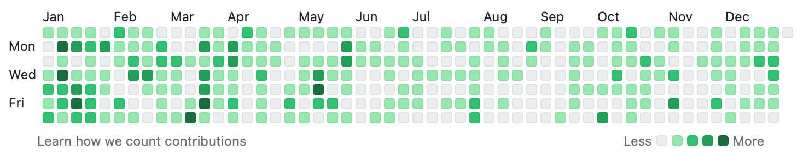

上半年的工作还是在 PLCT 给 Deepin 修包，年中之后因为生活上的别的事情比较忙就没有继续在 PLCT 干活

感觉今年似乎没有什么成型的大项目，基本是一些生活上有用的小工具和 Telegram Bot。感觉写东西的动力还是自己想用吧。如果写出来了别人也想用那就更开心了，这样的话会想着顺便写点文档之类的

折腾的东西倒还是有很多，像服务器，黑群晖，黑苹果，vps 之类的。以及每次赚到钱都会买一些奇奇妙妙的硬件升级家里的服务器

下半年尝试了一下 Rust，感觉比较咬打火机，还是没有 NodeJS 舒服。于是并没有接下来用 Rust 写项目的想法

## 生活

### 年前

元旦及之后的一段时间是在南昌和[洛灵酱](friend:luoling)过的。像往常一样工作日我写代码等她放学，放学之后一起玩儿，周末也会去找一些好玩儿的地方。洛灵放假之后我们就一起回了苏州来到了熟悉的 M.E.C. Lab（此时还是 M.E.C. Lab），度过了一段一家人欢聚一堂的时间。这次大概是我第一次和洛灵一起坐火车

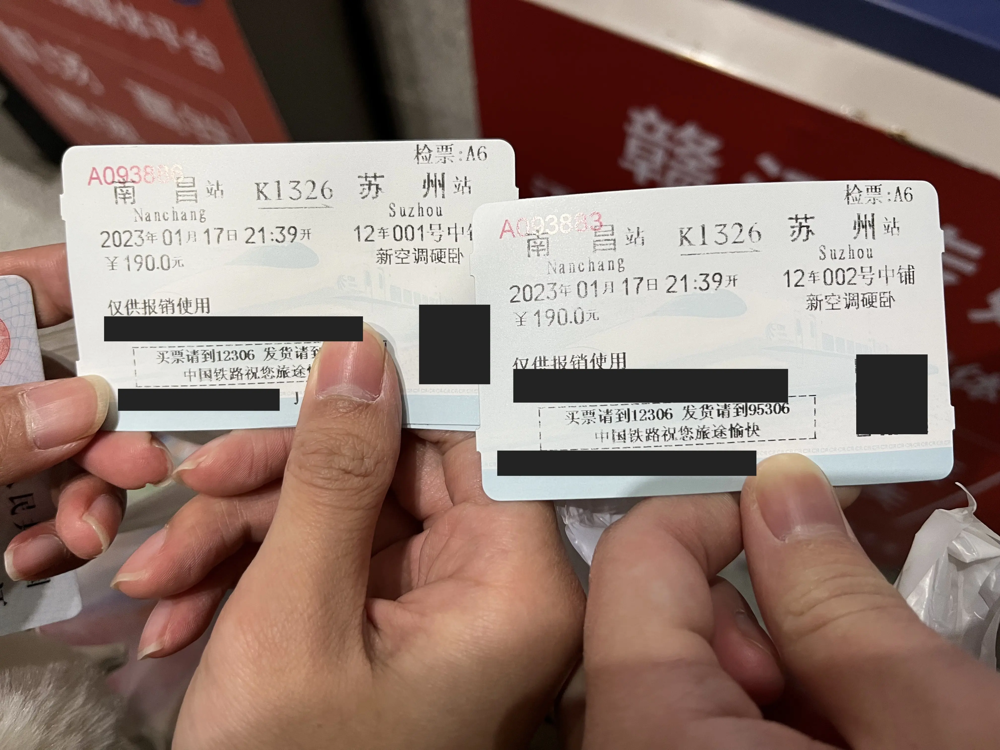

过大年的时候像 2022 年一样，一家人在 M.E.C. Lab 煮了火锅。这次 M.E.C. Lab 增加了新的成员，[小 CA](friend:ca) 和[莲子](friend:qwq)，于是大年夜吃火锅的阵容挺丰富的。

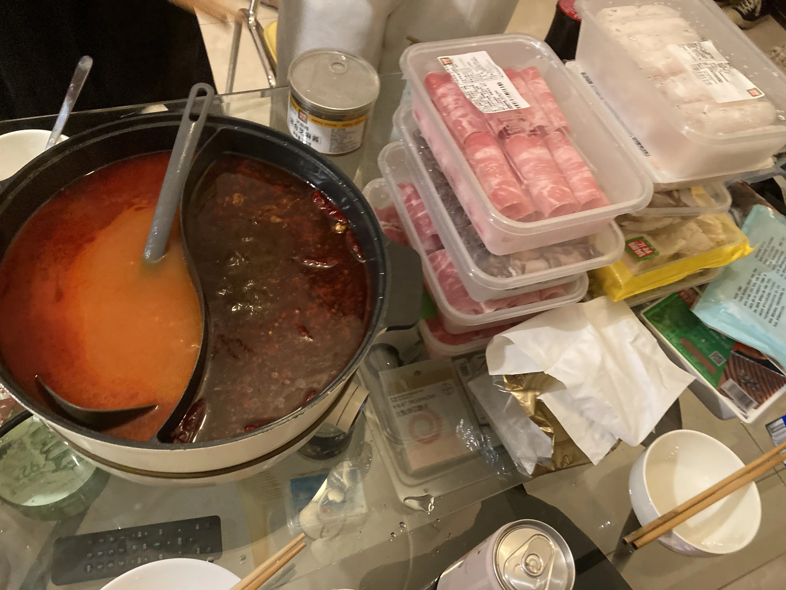

### 二月：基本上是自己玩儿

大概是度过了相对平静的一段时间。乌拉仙来找我玩了几天。以及我因为[芋头](friend:leohearts)和[山前](friend:estela)而开始玩了 APEX，于是我因为需要配一台游戏机而将我服务器的 R5 3600 换成了 R7 3700X 并将原先的 3600 用作了 Windows 游戏机。不过玩了这么久，我也没有提升什么实力，该打不到人还是打不到人

### 三月：成都之旅

三月出头的时候我去南昌陪了几天[小洛灵](friend:luoling)，然后就去成都找了[芋头](friend:leohearts)。疫情开始之后我也就没有怎么出过这么远的门。

在成都见到了[玛格丽特](https://next.dscf.one/)和[梓月](http://opengl106.oikawa.moe/)，和一家我很喜欢的酒吧 muchroom（说起来苏州机厅的排卡板上甚至一直有一张 muchroom 的名牌）

想找照片的但是找不到

### 四月：稍微面了几个人

四月份回了苏州，又去了一次上海。第一次见到了气波波、Revy 和 Robin，参观了 Revy 的泥头车之家。

Revy 给了我一块 EPYC 7551P，于是它成为了我主服务器的处理器并且一直用到现在。

### 五月：迎接新朋友

五一的时候有好多人来了苏州一起玩了几天

这个月的大事就是[小蓝莓](friend:chiba)从上海搬来了苏州，于是在苏州又多了一位新的可以串门的朋友。

从此 M.E.C. Lab 和蓝莓窝建立起了随时串门和内网互通的关系，开始了集群化，从此开始有了「M.E.C. Cluster」

M.E.C. Lab 也在这个月迎来了一周岁的生日

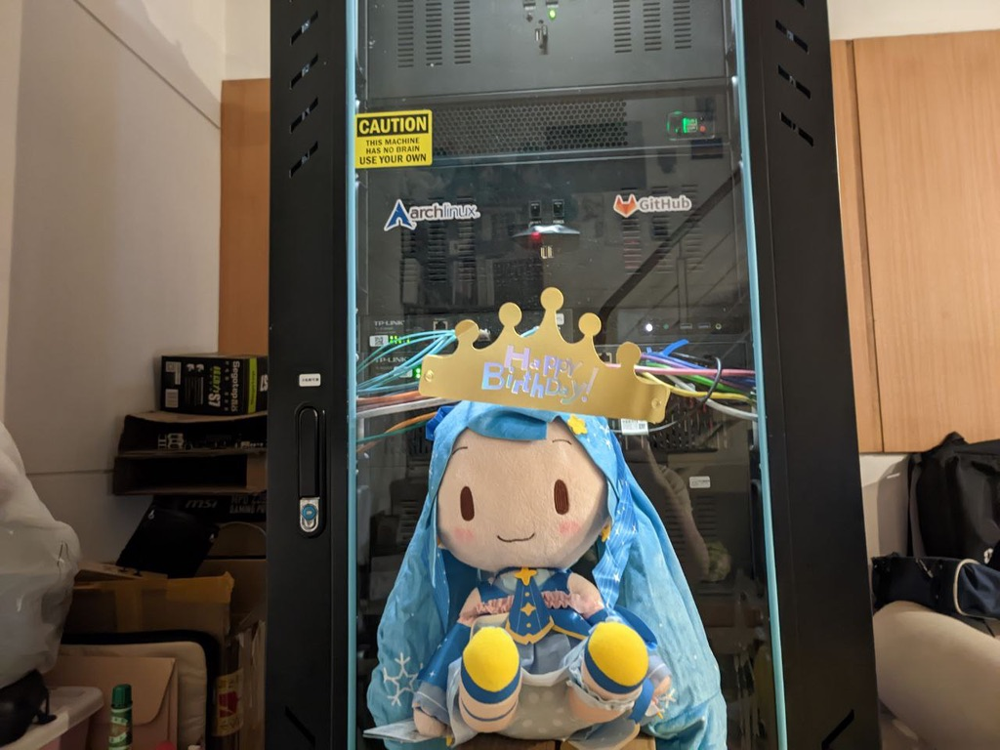

这个月还开了 Wise 卡，应该是我的第一张真正的外卡

### 六月：充实的跑来跑去

这又是发生了很多事的一个月

首先是首次遇到了 [iks](friend:iks)，是和 Robin 和气波波一起来的苏州，也是很开心的一场面面

然后是去南昌陪了小洛灵高考，高考之后迎接了 mai 历新年

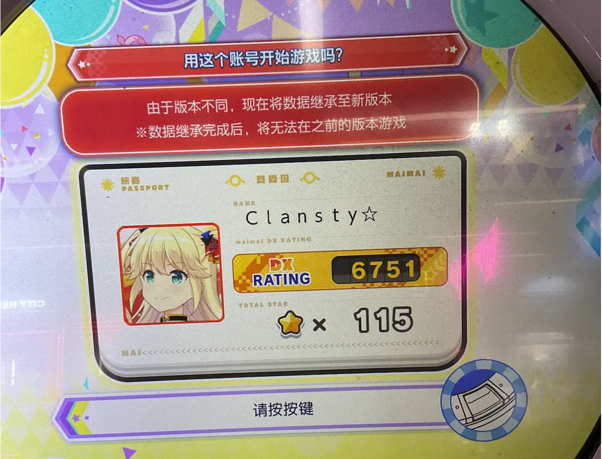

然后又在南昌玩了一段时间，去了一些之前没来得及去的地方，之后回了苏州

从此之后，小洛灵就可以一直和我一起住在苏州了

这个月还认识了[小草莓](friend:strawberry)，契机是小蓝莓打 mai 的时候在机厅抓回来的。很巧的是，她们的名字也很像

月底的时候带小洛灵去南京玩儿了一圈，这个月比较充实

### 七月：似乎也一直在玩儿

七月份的相册里有我和洛灵带[小草莓](friend:strawberry)去南昌玩儿的时候的照片，还有苏州博物馆分馆的照片。看起来是没怎么干活 都在玩儿了

这个月初次见到了 Syama，是一个我在推上关注了好久的 mai 友表示想面面，于是我们就去了她家，第一次摸到了 ADX

在南昌的时候还面到了[梓瑶](friend:ziyao)，是位写内核还搞我看不懂的无线电的大佬

### 八月：生日与猫

八月先是咬了一个打火机：坐 11 号线从苏州坐到上海。花了三个多小时，评价为不如高铁

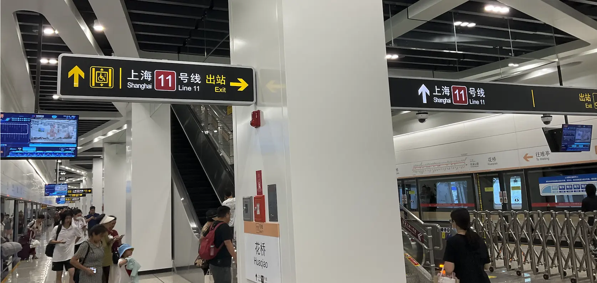

到了之后是和 tjk 和小魏的面面。当时没有怎么说话但是也算是第一次见面了

再过了两天就是我的生日。感谢[小洛灵](friend:luoling)、[小草莓](friend:strawberry)、双秀、Celia、[芋头](friend:leohearts)、[莲子](friend:qwq)、[北雁云依](friend:lixiang)、Syama 和我一起吃海底捞！

再接下来就是与「大猫」的相遇。这是一直在我们楼道里喵喵叫要饭的猫。我给了她几次猫粮之后她就[固定来 M.E.C. Lab 要饭和喝水](https://nya.one/notes/9iixoanxrg)。还会[自己开门出去](https://nya.one/notes/9ik5tln3lj)

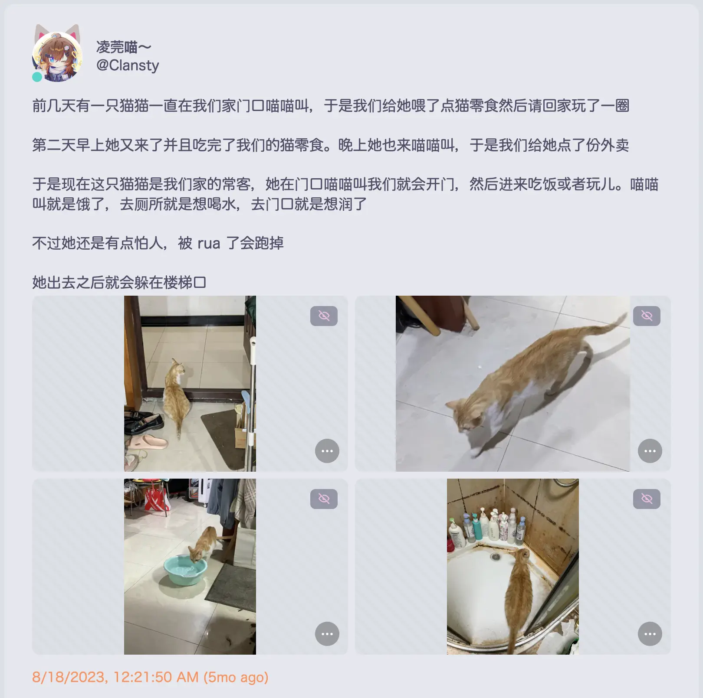

当时在 M.E.C. Lab 的大家（暂时）都很喜欢她

### 九月：意外的广州之行

月初的时候原先是和小洛灵去南昌拿一些东西然后回苏州的。但是因为她的亲戚想见而去了广州

在广州吃到了正版肠粉，去了一些好玩儿的地方。广州的各个城市之间是一种我很喜欢的互联状态，到处串门都非常方便

在广州面到了七云洛和木苒，很开心的一次贴贴

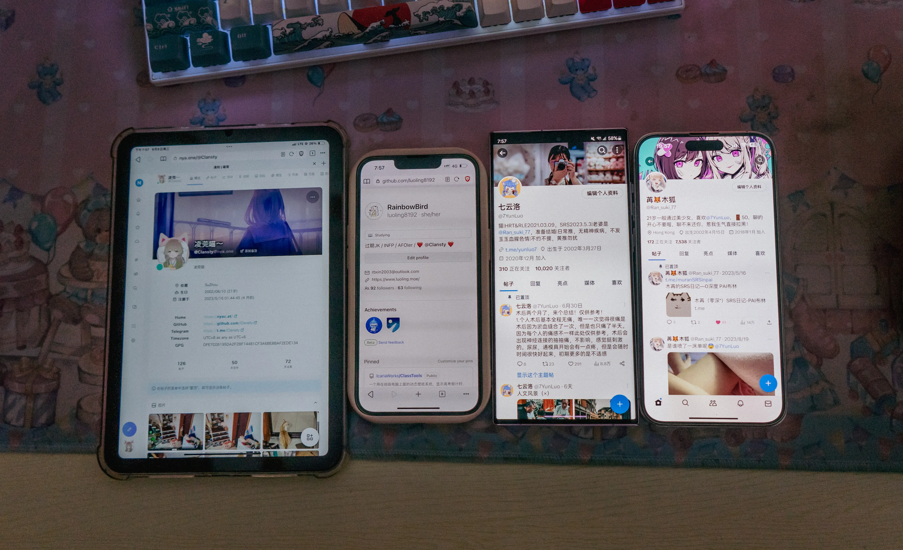

在广州停留的时间太短了，我还没玩够，下次还想再去。我们当时还想顺便去一趟香港，然而在外地办港澳通行证要 20 天，等办下来我们都走了。于是香港也没有去成

在这段时间里，苏州的大猫突然有一天待在 M.E.C. Lab 的一个纸箱里不走了，原来是在生小猫。山前用不要的被子给它们做了一个猫窝

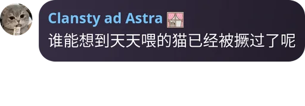

大猫生了两只小猫，压死了一只。于是只有一只存活。我们决定把它们养下来

月底的时候，[山前](friend:estela)润去西班牙了，M.E.C. Lab 因此没有了 E

### 十月：穷三代的第一代，不过也是最后一代

这个月入坑了相机，买了 Sony a6400。从此之后会和小洛灵「为了拍照而出去玩儿」

<iframe src="https://t.me/ttyUSB0w/1447?embed=1" width="100%" height="" frameborder="0" scrolling="no" style="overflow: hidden; color-scheme: light dark; border: none; min-width: 320px; height: 700px"/>

相机里最多的是猫

我自六月回苏州开始用了几个月的 Windows，这个月 Sonoma 推出之后我的主力操作系统又换成了 macOS

### 十一月：匆忙的搬家，泰国之旅，相逢和重聚

月初的时候我们给大猫和小猫打了疫苗

然后由于大猫多次攻击人，在一次导火索之后我、洛灵和两只猫只能匆忙找了一个房子搬家。搬到了市区里蓝莓窝很近的地方。背后原因复杂，并且我实际上是很不想搬家的。

这也意味着 M.E.C. Lab 解体，被 M.E.C. Cluster 代替。原先的 M.E.C. Lab（遗址）成为 Menci 窝，新的房子成为「0窝」，和蓝莓窝两两互联

不过后来发现搬家事实上也并不完全是坏事，因为搬完之后我发现这里离机厅很近，只要十分钟就可以从家里到 maimai 前面。

搬家的过程非常紧张，不到五天，我、洛灵、蓝莓就坐上了去泰国的飞机

这段时间里我分别认识了 [Liet](friend:liet) 和 [Nofated](friend:nof)，又认识了 [Sunyz](friend:sunyz) 和一些其他的人，都聊的很开心

Nofated 说来也很魔幻，最早的接触是在二手 Channel 里买了我一个路由器，买完之后想和我加友链。我容易忘事，就忘了很长一段时间。后来翻 Telegram 的时候翻到了还有这件事。加完之后在博客里发现原来这是「无 UserBot 版 Q2TG Mod」的作者。这次再接触到是发现 ta 转发了一条我很久很久以前的推特（

以及在 Nofated 的圈子里见到了曾经认识的[雨落](friend:qyl)

然后我的[器官没了](https://t.me/ClanstySRS)

### 十二月：新窝建设和可爱的你们

住院的时候我因为有机会独处，于是思考了很多问题，关于我自己，以及关于未来

说起来自从六月份小洛灵来苏州之后，我就很少去打 mai，因为她不感兴趣，我也懒得出去。术后我决定重拾打 mai 这项爱好，小洛灵不去我也可以自己去

我术后恢复的很快，第七天就开始到处蹦跶，去机厅打国际服 maimai。离开之前把分推到了 12200，感觉很圆满

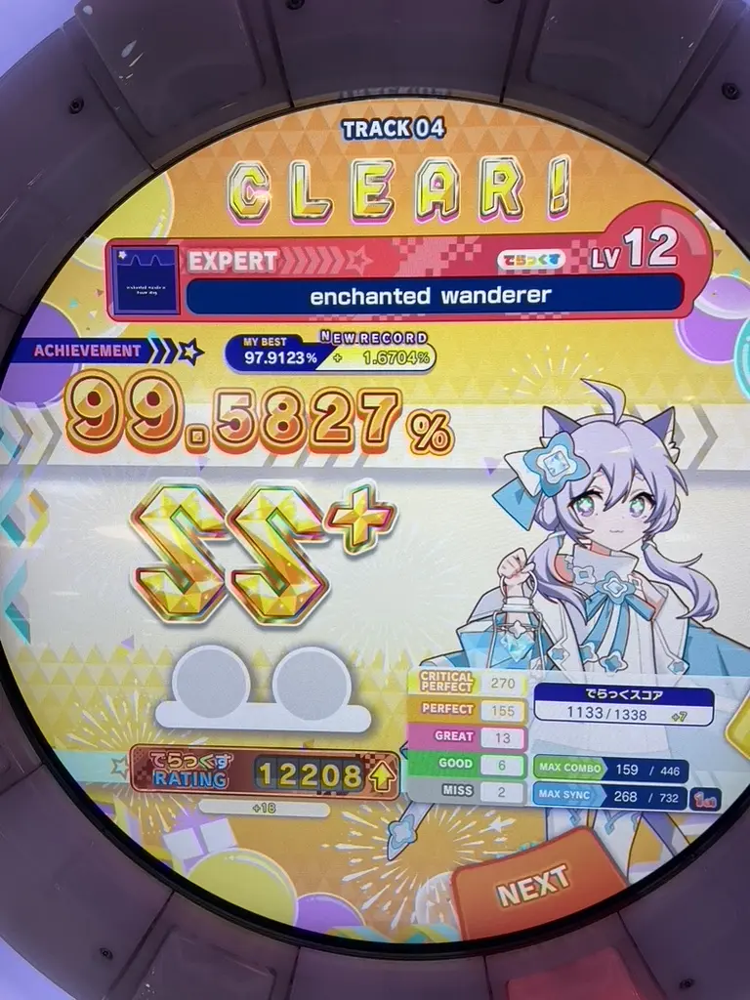

在泰国也去了好多好玩的地方，吃了好多好吃的东西。很喜欢这里

在回国之前面上了认识好久的 [Ayaka](friend:ayaka)

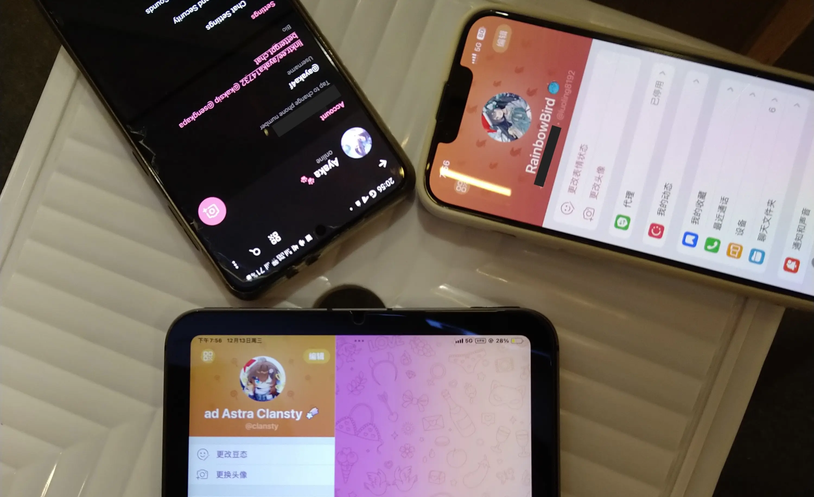

感觉上也是没玩够，还想再来玩的样子。以后可以再去泰国别的城市玩玩

回国之后陆续见了好多曾经见过的朋友们。首先是回国之前 [Liet](friend:liet) 临时需要来苏州，于是就直接让 ta 先住我窝里了，回国之后直接就先面上

同时也在建设这边的家

然后陆续贴了咕咕华、iks、花、喵粒子、神经元、小魏、usagi、Cody、冬鸟、Tomiya、tjk、气波波等人

跨年夜去了一位好久没见的朋友组织的跨年聚会，2023 也圆满结束了

都玩的很开心

### 2024：持续的期待和更好的我们

我感觉我自己活着的动力大概就是对生活中下一个 Milestone 的期待，其中大多都和大家有关。比如说要去找某个人玩儿之类的

今年也已经走过了许多，比如说迎接七云洛和 Reiraku 来苏州找我贴贴。最近的生活也很充实，我现在希望的生活规律是早上出门打 mai，下午在家里工作或者是写我感兴趣的代码，晚上可以玩玩游戏什么的（如下图）

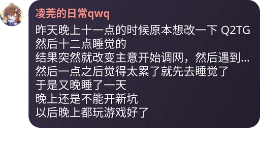

最近也修复了一些我自己的项目里长期积压的 bug 和咕了很久的新功能。当然，还有更多的功能还在咕着

我的下一个 Milestone 大概是和 [syz](friend:sunyz) 在上海玩儿吧

以及 2023 年还入坑了 ff14，我还可以和大家在艾欧泽亚贴贴！（已经有了这样的贴贴图）

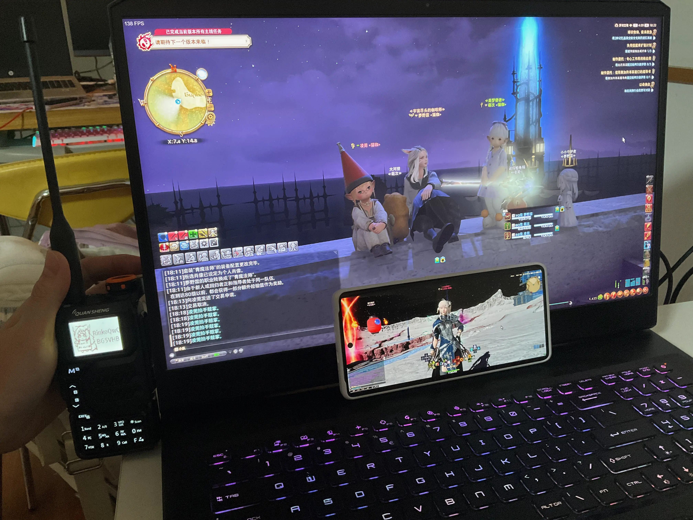

最终还是感谢大家一直以来的陪伴，期待在 2024 能有更好的相遇和更多快乐的时光！
