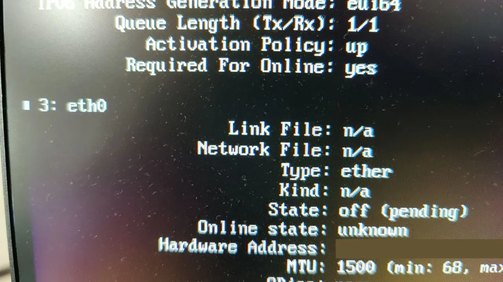

这篇文章是想讲我怎么在龙芯 3A5000 的板子上启动一个能正常使用的基于[新 ABI](https://bbs.loongarch.org/d/20) 的 Arch Linux。这里使用的 Arch Linux 是[史璞金老师的 Arch Linux Bootstrap 底包](https://github.com/archlinux-loongarch64/archlinux-loongarch64-base/releases/tag/v0.3)，内核是[孙海勇老师的 CLFS 内核](https://github.com/sunhaiyong1978/CLFS-for-LoongArch/releases/tag/untagged-629b3c005484675292bc)，版本 5.17.0 rc1。我没有自己编译带 arch 补丁的内核之类，因为懒。

我大概定义会看这篇文章的人是有一定的 Linux 基础知识的，所以一些比较顺利的细节我就不写了，我主要写这个过程中遇到的坑以及怎么解决它们

## 复制系统文件

我安装 CLFS 的分区是 btrfs，于是我希望创建一个子卷来安装 Arch Linux。

首先在 CLFS 中编译安装 `btrfs-progs`，参考[这里](https://www.linuxfromscratch.org/blfs/view/svn/postlfs/btrfs-progs.html)。

然后创建子卷

```bash
btrfs subvolume create /arch
```

然后把解压好的 bootstrap rootfs 复制进去就好

```bash
cp -a loongarch64.root/* /arch
```

rootfs 里面先装好 `arch-install-scripts`，挂载，然后 chroot 进去

```bash
mount /dev/nvme0n1p4 /arch -o subvol=/arch
/arch/usr/bin/arch-chroot /arch
```

## initrd 的修补

首先是尝试生成一个 Arch Linux 的标准 initrd

```bash
mkinitcpio -g /boot/initrd
```

第一次找不到模块目录，手动创建这个文件夹就可以了

```plain
[root@loong /]# mkinitcpio 
==> ERROR: '/lib/modules/5.17.0-rc1' is not a valid kernel module directory
```

生成的时候出现了找不到 `kmod` 和 `modprobe` 这样的命令，大概是 bootstrap 里面带的 `kmod` 这个包是残血版，自己重新编译一下就好了

然后编辑 `grub.cfg`

```c
menuentry 'arch' {
  linux /vmlinux root=/dev/nvme0n1p4 rw rootflags=subvol=/arch,compress=zstd:3 loglevel=3 systemd.show_status=1
  initrd /acpi-initrd /initrd
  boot
}
```

重启，不能启动，提示 `mount` 找不到，其实 `/usr/bin/mount` 这个二进制是有的

解包 initrd

```
todo 两个 file 的链接
```

然后我看了一下 `lib` 里面是有那个 so 的（没发现是 `lib64`），然后浪费了一些时间

然后第二天早上我发现了这个事，解包 x86_64 的 initrd 发现根目录有 `lib64` 是链接到 `/usr/lib` 的。

于是在解包的 initrd 里面创建一个叫 `lib64`，到 `usr/lib` 的链接

重新打包回 initrd（todo）

好，mount 那关过了，提示找不到 `/sbin/init`，是因为 bootstrap 里面缺少到 `/usr/lib/systemd/systemd` 的链接，在内核参数里面加上 `init=/usr/lib/systemd/systemd`（我试过创建这个符号链接，但是怎么都不行）

现在 initrd 这一关已经过了，可以拉起系统的 systemd 了。

其实我也试过不用 initrd，不过直接启动的 systemd 不会挂载 `proc` `sys` `dev` 这些分区，导致 systemd 启动到一半直接挂了，我也不太想写脚本绕过 initrd，还是搞定 initrd 的好

## 用户信息

如果现在重启系统，那么很多服务都会因为缺少对应的用户不能启动

由于 bootstrap 包的用户与组配置信息是空的，所以我们现在需要把原版 arch 的配置搬过来

先找一台稍微干净一点的装好了的 x86_64 Arch Linux，分别查看 `/etc/shadow` `/etc/passwd` `/etc/group` 这三个文件，在龙芯的机器里面把缺少的都补上

## linux-firmware

进入系统之后，首先是没有网络，并且连接不能设置为 UP，因为找不到 firmware

我尝试安装了 Arch Linux 的 firmware 包，但是还是不能加载。原因大概是 Arch 的 firmware 是 xz 压缩的，这需要内核开启 `CONFIG_FW_LOADER_COMPRESS` 选项，CLFS 的内核大概没有开启。所以我们挂载 CLFS 的根目录，把 `/usr/lib/firmware` 复制过来就好了

## 网络连接的配置

不知道为什么，我想使用 systemd networkd 的时候，systemd networkd 总是像识别不到网卡一样，根本不去处理 eth0，甚至连 link file 都显示 `n/a`，怎么搞也搞不好。但是这个时候已经可以用 iproute2 来设置 link 的状态为 UP 以及分配 IP 了



于是该用 netctl，直接复制 examples 里面的配置就可以。然后执行 `systemctl start 配置文件名称` 应该就可以联网了。不过，enable 之后重新启动会卡在等待网络设备出现，这可能是因为 `/sys` 的配置有问题，根本就没有 `/sys/subsystem` 这个文件夹。所以编辑一下 enable 命令输出里面的那个 conf 文件，把这个依赖项取消

```bash
vi /etc/systemd/system/netctl@配置文件名称.service.d/profile.conf
```

```ini
#BindsTo=sys-subsystem-net-devices-eth0.device
#After=sys-subsystem-net-devices-eth0.device
```

然后现在差不多就能正常重启啦

## 内核模块

一些内核模块也是缺少的，不过这大概不会太影响使用。内核模块位于 `/usr/lib/modules/5.17.0-rc1/`，也可以直接从 CLFS 中复制