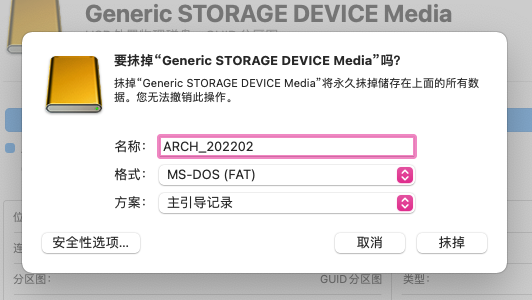
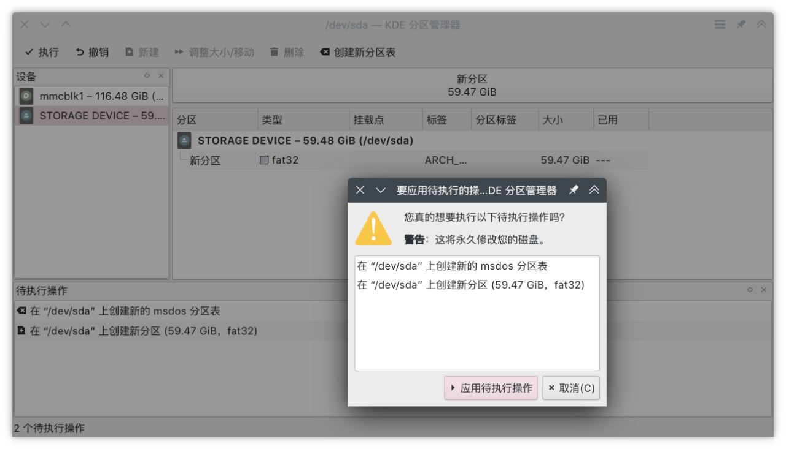
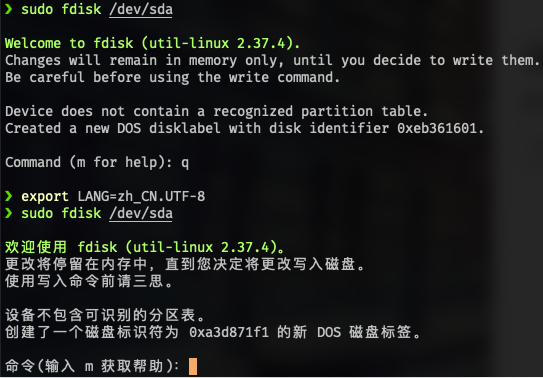
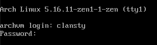
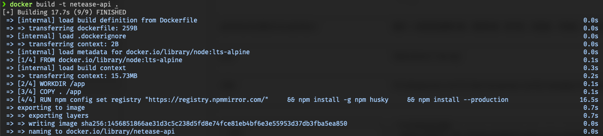

我从第一次用上 Arch Linux 开始大概有一年多了，在这段时间里我大概也装了十几台 Arch Linux 的设备吧，台式机 笔记本 服务器 ChromeBook 都有。所以我今天想说一下我自己安装 Arch Linux 的方法。

这篇文章可能会很长，但一定不是每一段内容都对你有意义。所以大概可以跳过不太相关的内容以节省时间。以及，我在编写这个的时候，大概参照的是大多数会想要试试 Arch Linux，并且已经有了一些 Linux 经验的人的水平。如果你不太清楚像 [SSH](https://wiki.archlinux.org/title/Secure_Shell_(%E7%AE%80%E4%BD%93%E4%B8%AD%E6%96%87)) [tty](https://en.wikipedia.org/wiki/Tty_(Unix)) [chroot](https://wiki.archlinux.org/title/Chroot_(%E7%AE%80%E4%BD%93%E4%B8%AD%E6%96%87)) 这些的概念的话，[维基百科](https://zh.wikipedia.org/wiki/Wikipedia:%E9%A6%96%E9%A1%B5)以及 [Arch Wiki](https://wiki.archlinux.org/title/Main_page_(%E7%AE%80%E4%BD%93%E4%B8%AD%E6%96%87)) 应该可以帮到你。对于 Arch Wiki，可能大部分条目默认会进入英文版本，对于大多数常用的条目，点击左上角的☰可以切换到中文版本。

也许一些概念其实并不需要太明白，比如说遇到「如果有 xxx」之类的时候，可以就当它有或者当它没有，试试看会怎样。像一些不明白的参数也可以这样。有可能出错了或者其实可以正常进行。在这个过程中，你应该会学到些什么的。

说起来，其实我遇到的奇怪设备应该也不算很多。对于安装 Arch Linux，以及很多其他与计算机相关的事情，都比较需要随机应变，并且尽量保持耐心。如果出现了什么特殊的问题，可以多尝试去网上寻找答案。如果累了或者被奇怪的问题困扰到了，不妨休息一下，去干点别的事情，或者出去走走，或许回来了就能解决了。

## 进入安装环境

其实这一节本来其实想叫做「启动盘」，不过想到我们并不一定需要启动盘才能进去安装环境。在一些情况下其实是通过原有系统 Chroot 进去的。

### 在普通电脑上全新安装的情况

这是最普通的情况，也就是在一台正常的基于 [UEFI](https://wiki.archlinux.org/index.php?title=Special%3ASearch&search=UEFI%20(%E7%AE%80%E4%BD%93%E4%B8%AD%E6%96%87)) 启动的笔记本或者台式机上。

我有一个安装了 [Ventoy](https://www.ventoy.net/cn/index.html) 多重启动管理工具的 U 盘，里面保存了各种操作系统的镜像。这时候我只需要从那个 U 盘启动并选择 Arch Linux 镜像就可以进入 ArchISO 环境了。

如果不想用 Ventoy，也可以使用 [balenaEtcher](https://www.balena.io/etcher/) 或者直接 dd 写入 Arch 的安装镜像

不过，有一些特殊的笔记本可能会出现比如说闪屏 键盘不能用这样的问题，这些情况大概是默认的驱动参数不兼容导致的，需要在启动的时候加上特定的参数来屏蔽或者启用一些驱动。这些需要的参数一般可以在网上搜索「机器的型号 Linux」很轻松的找到。

### 服务器上安装以及替换现有的 Linux 安装

这里说的大概是以下这几种情况：

- 你想在一台只能 SSH 访问的机器，比如说[在云服务商的服务器上安装](https://nyac.at/posts/cloud-server-arch-linux)
- 你想将当前运行的 Linux 系统替换成 Arch 或者你想在当前 Btrfs 分区的另一个子卷上安装 Arch（不重新格式化当前操作系统的硬盘）
- 你想在另一个硬盘或者分区上安装 Arch Linux

这时候我们并不需要 Arch Linux 的 ISO 镜像，只需要一个打包好的 Arch 根目录。在这样的环境下，安装环境基本都是在图形界面的终端软件中打开的，这样我们还可以很方便的复制和粘贴命令。

我们打开任意一个镜像站的[类似这样的路径](https://mirrors.bfsu.edu.cn/archlinux/iso/latest/)

```url
https://mirrors.bfsu.edu.cn/archlinux/iso/latest/
```

可以找到形如 [`archlinux-bootstrap-2022.02.01-x86_64.tar.gz`](https://mirrors.bfsu.edu.cn/archlinux/iso/latest/archlinux-bootstrap-2022.02.01-x86_64.tar.gz) 的文件，这就是我们需要的根目录包。对于需要替换现有系统的安装情况，我们最好把它下载到 `/tmp` 下，其他情况我们可以把它放在任意的位置。

然后解压它，我们应该能得到一个叫做 `root.x86_64` 的目录。我们需要 bind mount 它自己，使它成为一个挂载点来避免一些 pacman 的错误。

在接下来的命令里，我们假设 root 包被下载和解压到了 `/tmp` 目录下。

```bash
mount --bind /tmp/root.x86_64 /tmp/root.x86_64
```

然后就可以通过 rootfs 包自带的 `arch-chroot` 命令切换到安装环境下。

```bash
/tmp/root.x86_64/bin/arch-chroot /tmp/root.x86_64/
```

由于 rootfs 是没有设置好镜像源的，我们需要先手动设置一下镜像源（这个包是最小安装，并没有自带什么文本编辑器）

```bash
echo 'Server = https://mirrors.bfsu.edu.cn/archlinux/$repo/os/$arch' > /etc/pacman.d/mirrorlist
```

你可以修改为你喜欢的镜像站。对于海外的机器，可以使用 Cloudflare 镜像

```bash
echo 'Server = https://cloudflaremirrors.com/archlinux/$repo/os/$arch' > /etc/pacman.d/mirrorlist
```

然后初始化 pacman 到 pgp 密钥，就可以使用了

```bash
pacman-key --init
pacman-key --populate archlinux
```

在 Arch ISO 中，这些步骤是自动完成的。

需要注意的是，如果是想把当前正在运行桌面的设备系统替换为 Arch Linux，请切换到 tty 或者在 SSH 中进入 chroot。如果使用 SSH，接下来就不要碰那台电脑了，以免删除系统时破坏了与图形相关的东西导致图形界面不稳定引发问题。最好还需要停止图形界面和不必要的服务，只保留联网和 sshd。因为在这种情况下我们将会强行移除正在运行的系统。

如果正在重装云服务器，也请停止不必要的服务，清理一下 `/tmp` 目录，并且保持稳定的网络连接。最好是启用连接保活心跳

```shell
vim ~/.ssh/config
```

```shell
Host *
  ServerAliveInterval 30
  ServerAliveCountMax 100
```

### 一些阴间的设备

#### [32 位 UEFI 的设备](boot-64bit-os-on-32bit-uefi)

有些低端设备，大多是使用英特尔凌动（Atom）处理器的设备，使用 32 位的 UEFI 固件来安装 32 位 Windows 以节省性能。

对于这些设备，我们其实是可以通过 32 位 GRUB 引导 64 位内核的，只需要准备一个 [32 位 GRUB 的 EFI 文件](https://wwi.lanzouw.com/iOSPi0064h4h) 放入 `EFI/BOOT` 中。这时候不能用 Ventoy 了，因为 Ventoy 是 64 位的

Arch 官方的 ISO 文件其实是一个双分区镜像，包含了 [ISO9660](https://zh.wikipedia.org/zh-hans/ISO_9660) 的数据分区和 EFI 启动分区，因为 ISO9660 时光盘的格式，写入到 U 盘之后在很多系统中不可读，BIOS 也可能识别不了，所以需要另一个分区来存放一些启动文件。Arch ISO 镜像分别使用 Systemd-boot 和 Syslinux 作为 EFI 和 BIOS 的启动方式，内核加载之后通过卷标来找启动盘并挂载根目录的 [SquashFS](https://en.wikipedia.org/wiki/SquashFS) 镜像

我们需要先创建一个常规的 Arch USB，比如说 [balenaEtcher](https://www.balena.io/etcher/) 写入 Arch 安装镜像。EFI 文件要放在那个 Fat32 格式的分区中。然而这不是推荐的方法，因为这个 EFI 分区在一些系统上无法被正常挂载，而且分区所剩的空间很小，不够放下 GRUB 启动文件

最好的做法是[手动分区 USB 设备并写入安装镜像](https://wiki.archlinux.org/title/USB_flash_installation_medium#In_GNU/Linux_4)，而不使用 ISO9660 格式，把所有数据都存在 Fat32 分区里面，还能有效利用 U 盘剩余空间

首先确保 U 盘是有分区表的，而且是 MBR 分区表（因为有些操作系统会在创建 GPT 分区表时自动创建 ESP MSR 之类的分区），而不是裸盘格式化（`sdb1` 而不是 `sdb`）然后把 U 盘分成单个 Fat32 分区。一定要给分区设置卷标并记住它，最好是和 Arch ISO 一样的名称，也就是 `ARCH_YYYYMM` 比如说 `ARCH_202202`





然后挂载该分区，并解压 Arch ISO 镜像到 U 盘

```bash
bsdtar -xf archlinux-2022.02.01-x86_64.iso -C /Volumes/ARCH_202202
```

将[下载](https://wwi.lanzouw.com/iOSPi0064h4h)的文件放入 `EFI/BOOT`，然后就可以把 U 盘连接到待安装的设备启动了

进入 GRUB 命令行之后，我们首先要找到我们的 U 盘是哪个设备

```shell
Minimal BASH-like line editing is supported. For the first word, TAB lists possible command completions. Anywhere else TAB lists possible device or file completions.

grub> ls
(memdisk) (hd0) (hd0, msdos1) (hd1) (hd1, gpt3) (hd1, gpt2) (hd1, gpt1) (hd2) (hd3)

grub> ls (hd0, msdos1)
Partition hd0, gpt2: Filesystem type fat - Label 'ARCH_202202', UUID 01DE-19ED - Partition start at 205824KiB Total size 62160896KiB

grub> ls (hd0, msdos1)/
arch/ efi/ loader/ syslinux/ shellx64.efi
```

需要注意的是，grub 的 ls 命令末尾加不加 `/` 是不一样的，不加会显示设备信息，加了就会列出文件

在这个例子里，`(hd0, msdos1)` 就是我们要找的设备号。然后我们用下面的命令来启动系统

```bash
grub> root=(hd0, msdos1)
grub> linux /arch/boot/x86_64/vmlinuz-linux archisobasedir=arch archisolabel=ARCH_202202 add_efi_memmap
grub> initrd/arch/boot/x86_64/initramfs-linux.img
grub> boot
```

#### 自带光盘的云服务器

之前遇到过有一家云服务商，预置了一个包含 GRUB 的虚拟光盘在虚拟光驱里，用于引导硬盘系统。那台机器我装完之后重启进了 GRUB 命令行，我还以为我 GRUB 配置的不对（（

这种情况下需要根据具体情况进行调整。


启动之后，我们先得确保系统时间是准确的

```bash
timedatectl set-ntp true
```

## 连接无线网络（可选）

如果你正在使用 Arch ISO 并且需要连接无线网络的话。有线网络会自动通过 DHCP 配置。

首先，运行 `iwctl`，这会进入 iwd 的命令控制界面。然后通过下面的命令查看网卡的名称

```shell
device list
```

一般来说，无线网卡的名称应该会是 `wlan0`。然后我们需要扫描网络

```shell
station wlan0 scan
```

下面的命令可以列出所有扫描到的网络的名称（SSID）。如果你很清楚需要连接的网络的名称，可以不执行这一步

```shell
station wlan0 get-networks
```

然后连接到网络，系统会提示你输入密码

```shell
station wlan0 connect TP-LINK-XXXX(改为你网络的名称)
```

如果无线网络没有正常连接的话，你可以考虑将你的手机 USB 连接到电脑，并开启网络共享。

## 打开 Arch ISO 的 SSH（可选）

如果你是进入的 Arch ISO 环境，并且你手上有另一台在同一内网中并且可以使用的电脑的话，可以在 Arch ISO 中开启 SSH 服务器，然后使用你手上能用的电脑远程给它安装 Arch Linux。这样的话，我们可以方便的复制粘贴命令。

如果你并不能通过 SSH 之类的方法安装的话，其实有一些「为了以后」的步骤可以暂时先跳过，等进入系统之后再做。

```bash
ip addr # 看下机器的 IP 地址并记住它
passwd # 给 Root 账户设置一个密码
systemctl start sshd
```

如果你是一台显示器两台台式机的样子，现在可以把信号源切换到已安装好操作系统的电脑了

如果被安装到电脑是笔记本的话，记得连接充电器并且尽量不要合上盖子

现在，在你正常使用的电脑上，通过 SSH 连接到被安装到电脑

### 普通方式连接网络的情况

```bash
ssh root@192.168.1.123 # 刚刚的 IP 地址
```

### 手机共享网络的情况

如果你是使用了安卓手机的 USB 共享，请先在安卓手机上打开 SSH 服务器。可以[使用 Linux Deploy](https://nyac.at/posts/android-chroot-arch-linux) 或者在 [Termux](https://termux.com/) 安装并启动 sshd

#### 使用 Linux Deploy 或其他在系统层运行的 SSH 服务端（占用 22 端口）

某些在 Android 中运行的 sshd 服务端，比如说 [Magisk SSH 模块](https://github.com/Magisk-Modules-Repo/ssh)，只支持密钥对验证。请根据相关说明将公钥放至指定的地方

```bash
ssh root@192.168.213.84(被安装设备的 IP 地址) -J shell(或其他用户名)@192.168.1.123(手机的 IP 地址)
```

#### 使用 Termux

首先在 Termux 中查看自己当前的用户名。每个 Android 应用程序都在独立的用户名中运行

```bash
whoami # u0_a394
```

需要注意的是，Termux 的 sshd 只可以通过密钥对进行身份验证，需要在手机上提前配置好自己的公钥

```bash
mkdir -p ~/.ssh
chmod 700 ~/.ssh
curl https://keys.your.domain/id_rsa.pub >> ~/.ssh/authorized_keys # 或者其他方式，比如说 echo
chmod 600 ~/.ssh/authorized_keys
```

启动 sshd

```bash
sshd
```

在现在正常使用的电脑上

```bash
ssh root@192.168.213.84(被安装设备的 IP 地址) -J u0_a394(改成刚刚 whoami 看到的用户名)@192.168.1.123(手机的 IP 地址):8022
```

#### 使用手机上的 SSH 软件

大概不太推荐这种方法，虽然这样可以直接连接前面的地址，不过这操作起来还不如直接在 tty 中方便（（

## 设置 LANG 变量（可选）

系统语言在未配置的情况下，一般会以英文来显示。不过，如果我们不是在 tty 环境中，可以在安装之前就设置中文语言变量，这样接下来的提示之类都可以以中文来显示。这样的话，看起来会更轻松，并且更不容易引起操作错误。

如果你是在 tty 中进行安装的，请不要这样设置，因为一般来说 tty 不支持中文，出现中文的地方都会显示口口。除非你是 cjktty 之类。

大概 Arch ISO 应该是没有 locale-gen 中文语言的，还需要生成一下语言文件

```bash
echo 'en_US.UTF-8 UTF-8
zh_CN.UTF-8 UTF-8' > /etc/locale.gen
locale-gen
export LANG=zh_CN.UTF-8
```



## 分区，创建子卷，或是清除现有的操作系统

根据安装系统的情况，我们决定要更改磁盘分区，和/或创建子卷，或者是清除现有系统来安装新的系统

### 给硬盘分区或重新分区

首先通过 `lsblk` 确定自己的硬盘是哪个，然后执行 [fdisk](https://wiki.archlinux.org/title/Fdisk_(%E7%AE%80%E4%BD%93%E4%B8%AD%E6%96%87)) 进行分区

```bash
fdisk /dev/sda
```

这里的 `sda`，在有些情况下会是 `sdb` `vda` `nvme0n1` `mmcblk0` 之类。这里不讨论磁盘阵列（`md`）之类，因为这会导致安装步骤发生很大的改变。根分区也可以位于其他设备上，比如说 nfs。这样的话只需要很小的设备作为启动盘来加载内核并且挂载网络设备作为根目录

#### 使用 UEFI 情况下的分区

使用 UEFI 时，我们使用 GPT 分区表。如果硬盘还没有初始化或者想要清空重来，我们就先创建一个 GPT 分区表，初始化硬盘

```shell
命令(输入 m 获取帮助)：g
已创建新的 GPT 磁盘标签(GUID: BFA9A3BD-0896-BD4D-8B34-D858D73F0FB3)。
```

如果硬盘中目前有其他操作系统，并且我们希望保留它，那么我们先在原系统中将现有分区调小，或者删除不需要的分区，来产生一片连续的未分配区域

对于刚初始化或者没有 ESP 分区的磁盘，我们现在创建一个 ESP 分区。如果有其他系统之类的情况，已经有 ESP 分区了，那不需要重新创建，不过需要确保 ESP 分区至少有 300MB

```shell
命令(输入 m 获取帮助)：n
分区号 (1-128, 默认  1):
第一个扇区 (2048-134217694, 默认 2048):
最后一个扇区，+/-sectors 或 +size{K,M,G,T,P} (2048-134217694, 默认 134217694): +512M

创建了一个新分区 1，类型为“Linux filesystem”，大小为 512 MiB。
```

对于「最后一个扇区」，我们可以用+大小的形式来表示我们希望这个分区多大，-大小表示在创建的分区末尾保留多少空余的空间，也就是分区大小为可用空间 - 你输入的大小。不要忘记 + 号或 - 号

创建完分区之后，我们还需要给分区一个类型标记。分区的默认类型是数据，我们需要创建完之后需要改成 SWAP 或者 ESP。下面是一些常用的类型值

| 序号 | 名称             | UUID（没有用的啦）                   |
| ---- | ---------------- | ------------------------------------ |
| 1    | EFI System       | C12A7328-F81F-11D2-BA4B-00A0C93EC93B |
| 19   | Linux swap       | 0657FD6D-A4AB-43C4-84E5-0933C84B4F4F |
| 20   | Linux filesystem | 0FC63DAF-8483-4772-8E79-3D69D8477DE4 |

使用 `t` 来更改现有分区的类型。由于现在只有一个分区，它自动选中了。我们需要把这个分区设置为 EFI System 也就是 ESP

```shell
命令(输入 m 获取帮助)：t
已选择分区 1
分区类型或别名（输入 L 列出所有类型）：1
已将分区“Linux filesystem”的类型更改为“EFI System”。
```

接下来，我们要创建一个 SWAP 分区。由于 SWAP 的速度比物理内存根本无法比较，所以我们应该让机器尽量少的使用 SWAP。当 SWAP 被使用时，可以感受到设备明显变慢。SWAP 的大小众说纷纭，以下是我个人的做法：

- 对于内存较小的服务器（2GB 及以下），SWAP 可以设置为内存的两倍。因为这样的服务器不会运行太多的服务，不过可能需要突发性的占用比较多的内存
- 对于 4GB 内存的服务器，SWAP 设置成 4GB
- 对于 8GB 内存的服务器，SWAP 可以根据将来的负载大小设置成 2GB 或者 4GB
- 对于 8GB 及以下内存的桌面端，SWAP 设置成 8GB。因为是桌面端但是内存较小，在突发需要占用更多内存时应该多给一点交换空间
- 对于 16GB 及以上内存的桌面端，SWAP 不超过 4GB。这样的机器有理由多用物理内存，就不应该用太多 SWAP

```shell
命令(输入 m 获取帮助)：n
分区号 (2-128, 默认  2):
第一个扇区 (1050624-134217694, 默认 1050624):
最后一个扇区，+/-sectors 或 +size{K,M,G,T,P} (1050624-134217694, 默认 134217694): +2G

创建了一个新分区 2，类型为“Linux filesystem”，大小为 2 GiB。

命令(输入 m 获取帮助)：t
分区号 (1,2, 默认  2): 2
分区类型或别名（输入 L 列出所有类型）：19

已将分区“Linux filesystem”的类型更改为“Linux swap”。
```

然后，将剩余的空间全都分给系统。输入 n，然后一路回车下去就可以了。也不需要改类型

```shell
命令(输入 m 获取帮助)：n
分区号 (3-128, 默认  3):
第一个扇区 (5244928-134217694, 默认 5244928):
最后一个扇区，+/-sectors 或 +size{K,M,G,T,P} (5244928-134217694, 默认 134217694):

创建了一个新分区 3，类型为“Linux filesystem”，大小为 61.5 GiB。
```

最后，输入 `w` 来将更改写入硬盘

```shell
命令(输入 m 获取帮助)：w
分区表已调整。
将调用 ioctl() 来重新读分区表。
正在同步磁盘。
```

> 使用写入命令前请三思。

#### 使用 Legacy BIOS 情况下的分区

在这种情况下，我们使用 MBR 分区表，也就是 fdisk 中的 DOS 分区表。然后，第一个分区的类型保留默认的 Linux 数据不更改。如果需要共存其他的系统，也需要创建这个分区。所有分区尽量都创建为主分区。其他细节都与 UEFI 方式差异不大

在 MBR 分区表中，分区类型代码有所不同

| 代码 | 名称       |
| ---- | ---------- |
| 82   | Linux swap |
| 83   | Linux      |

```shell
❯ fdisk /dev/sda

欢迎使用 fdisk (util-linux 2.37.4)。
更改将停留在内存中，直到您决定将更改写入磁盘。
使用写入命令前请三思。


命令(输入 m 获取帮助)：o
创建了一个磁盘标识符为 0x7704d93d 的新 DOS 磁盘标签。

命令(输入 m 获取帮助)：n
分区类型
   p   主分区 (0 primary, 0 extended, 4 free)
   e   扩展分区 (逻辑分区容器)
选择 (默认 p)：p
分区号 (1-4, 默认  1):
第一个扇区 (2048-134217727, 默认 2048):
最后一个扇区，+/-sectors 或 +size{K,M,G,T,P} (2048-134217727, 默认 134217727): +512M

创建了一个新分区 1，类型为“Linux”，大小为 512 MiB。

命令(输入 m 获取帮助)：n
分区类型
   p   主分区 (1 primary, 0 extended, 3 free)
   e   扩展分区 (逻辑分区容器)
选择 (默认 p)：p
分区号 (2-4, 默认  2):
第一个扇区 (1050624-134217727, 默认 1050624):
最后一个扇区，+/-sectors 或 +size{K,M,G,T,P} (1050624-134217727, 默认 134217727): +2G

创建了一个新分区 2，类型为“Linux”，大小为 2 GiB。

命令(输入 m 获取帮助)：t
分区号 (1,2, 默认  2): 2
Hex 代码或别名（输入 L 列出所有代码）：82

已将分区“Linux”的类型更改为“Linux swap / Solaris”。

命令(输入 m 获取帮助)：n
分区类型
   p   主分区 (2 primary, 0 extended, 2 free)
   e   扩展分区 (逻辑分区容器)
选择 (默认 p)：p
分区号 (3,4, 默认  3):
第一个扇区 (5244928-134217727, 默认 5244928):
最后一个扇区，+/-sectors 或 +size{K,M,G,T,P} (5244928-134217727, 默认 134217727):

创建了一个新分区 3，类型为“Linux”，大小为 61.5 GiB。

命令(输入 m 获取帮助)：w
分区表已调整。
将调用 ioctl() 来重新读分区表。
正在同步磁盘。
```

#### 格式化并挂载磁盘

现在可以 `lsblk` 一下看看分区是否正确

```shell
❯ lsblk
NAME   MAJ:MIN RM   SIZE RO TYPE MOUNTPOINTS
sda      8:0    0    64G  0 disk
├─sda1   8:1    0   512M  0 part
├─sda2   8:2    0     2G  0 part
└─sda3   8:3    0  61.5G  0 part
```

这表明，我们刚才创建的分区分别在 `sda1` `sda2` 和 `sda3`。这很典型

然后，这三个分区将分别以 `fat32` `swap` `btrfs` 格式化。对于 Root 分区，我偏向于使用 Btrfs，因为它有不止这些强大的功能

- 子卷，可以进行快照，也可以在重装时保留 `/home`，或是在一个分区内安装双系统并共享 `home`，或是将 `/home` 克隆一份给另外一个系统，而只占一份空间
- Copy on Write，我可以把文件快速的复制一份而不额外消耗空间，两份文件可以独立修改，被修改的部分才占空间。子卷克隆等功能也由 CoW 支持
- 压缩，比如说可以用 zstd 进行全盘压缩，甚至可以获得更好的性能
- Docker 有专门优化

现在我们将 ESP 格式化为 Fat32

如果你在创建分区的时候硬盘上已经有 ESP 分区了，请不要执行以下命令，不然会破坏已有系统的启动项

```bash
mkfs.fat -F 32 /dev/sda1
```

如果你是 MBR 分区表方案，那么这个分区格式化为 Ext4

```bash
mkfs.ext4 /dev/sda1
```

然后，我们格式化剩下来的两个分区

```bash
mkswap /dev/sda2
mkfs.btrfs /dev/sda3
```

由于 rootfs 镜像是不自带 btrfs 相关程序的，如果你使用 chroot 来进入安装环境的话，可能会找不到 `mkfs.btrfs`，这时需要安装 `btrfs-progs`

```bash
pacman -Sy btrfs-progs
```

然后我们先启用 swap

```bash
swapon /dev/sda2
```

### 创建子卷

对于子卷，我们大概会这样分配。这是一些推荐的做法的综合（（ [1](https://wiki.archlinux.org/title/snapper#Suggested_filesystem_layout) [2](https://github.com/archlinux/archinstall/blob/9fb8d3164ce07e6cd08fe60f2e6f1203ccb8991a/archinstall/lib/disk/user_guides.py#L102) [3](https://github.com/classy-giraffe/easy-arch/blob/main/easy-arch.sh#L257)

| 子卷  | 挂载点                |
| ----- | --------------------- |
| @     | /                     |
| @home | /home                 |
| @root | /root                 |
| @srv  | /srv                  |
| @logs | /var/log              |
| @pkgs | /var/cache/pacman/pkg |

如果是在同一个 btrfs 分区中安装并与现有系统并存，那可以把重复的名称改一改，比如说 `@` 改成 `@arch` 之类

我们先将 `sda3` 临时挂载到 mnt 下，然后创建这些子卷

```bash
mount /dev/sda3 /mnt
btrfs subvolume create /mnt/@
btrfs subvolume create /mnt/@home
btrfs subvolume create /mnt/@root
btrfs subvolume create /mnt/@srv
btrfs subvolume create /mnt/@logs
btrfs subvolume create /mnt/@pkgs
umount /mnt
```

然后，挂载刚才创建的那些子卷。这里推荐启用 Btrfs 的压缩以提升性能

诶 这里其实我可以创建一个变量，然后你们就只需要改第一行，下面的都可以直接复制了

```bash
ROOT_PART=sda3
mount -o compress=zstd:3,subvol=@ /dev/$ROOT_PART /mnt
mkdir -p /mnt/{boot,home,root,srv,var/log,var/cache/pacman/pkg} # 创建所有挂载点的文件夹，因为只有文件夹存在才能挂载
mount -o compress=zstd:3,subvol=@home /dev/$ROOT_PART /mnt/home
mount -o compress=zstd:3,subvol=@root /dev/$ROOT_PART /mnt/root
mount -o compress=zstd:3,subvol=@srv /dev/$ROOT_PART /mnt/srv
mount -o compress=zstd:3,subvol=@logs /dev/$ROOT_PART /mnt/var/log
mount -o compress=zstd:3,subvol=@pkgs /dev/$ROOT_PART /mnt/var/cache/pacman/pkg
```

然后挂载 Boot 分区

```bash
mount /dev/sda1 /mnt/boot
```

## 安装系统

在这之前，先确保该挂载的分区都挂载好了，该启用的 SWAP 已经都启用了

如果你需要使用代理，pacman 会遵守 `all_proxy` 环境变量

```bash
export all_proxy="socks5://192.168.1.2:1080"
```

基本的软件包们，我比较喜欢 `linux-zen` 内核

```bash
pacstrap /mnt base base-devel linux-zen linux-zen-headers linux-firmware vim nano dhcpcd openssh zsh man-db man-pages btrfs-progs
```

这时候，如果有别的想要安装的软件包，就一并装上吧

比如说如果需要 KDE 桌面环境的话，就把这些加在后面

```bash
plasma konsole dolphin ark dolphin-plugins ffmpegthumbs filelight gwenview kate kcalc kdeconnect kdialog kio-extras kolourpaint kompare okular svgpart spectacle
```

这是我挑出来 KDE 全家桶里面有用的那些包。同时，还得装上中日韩字体来保证方块字都能正常显示

```shell
adobe-source-han-sans-otc-fonts adobe-source-han-serif-otc-fonts noto-fonts-cjk wqy-microhei wqy-microhei-lite  adobe-source-han-serif-cn-fonts adobe-source-han-serif-tw-fonts adobe-source-han-sans-cn-fonts adobe-source-han-sans-tw-fonts wqy-zenhei wqy-bitmapfont ttf-arphic-ukai ttf-arphic-uming opendesktop-fonts ttf-hannom adobe-source-han-sans-jp-fonts adobe-source-han-sans-kr-fonts
```

还有 fcitx5 输入法

```shell
fcitx5-im fcitx5-chinese-addons fcitx5-pinyin-zhwiki
```

如果用无线网络的话，那就装上 [NetworkManager](https://wiki.archlinux.org/title/NetworkManager_(%E7%AE%80%E4%BD%93%E4%B8%AD%E6%96%87)) 吧

```shell
networkmanager
plasma-nm # 如果和 KDE 一起用的话
```

最好还要安装适合你处理器的[微码更新](https://wiki.archlinux.org/title/Microcode_(%E7%AE%80%E4%BD%93%E4%B8%AD%E6%96%87))

```shell
amd-ucode intel-ucode
```

装完之后，我们还需要初始化新系统的 fstab，这样开机之后能够正确的挂载分区

```bash
genfstab -U /mnt > /mnt/etc/fstab
```

另：在 [Arch 的官方 Wiki](https://wiki.archlinux.org/title/Installation_guide_(%E7%AE%80%E4%BD%93%E4%B8%AD%E6%96%87)#Fstab) 中，这里是 `>>` 而不是 `>`。`>>` 的意思是将输出内容追加到尾部，而 `>` 会覆盖文件内容。如果我们使用 `>>` 多次运行上面的命令会导致生成的 fstab 内容重复好多遍，可能会出现一些问题

安装好后，就直接 chroot 进入新系统吧

```bash
arch-chroot /mnt
```

## 链接 vim

在 Arch Linux 中，vi 是一个很老的包，并且和 vim 不是同一个，安装 vim 不会覆盖 vi。而 vi 很难用，不符合我们现在用 vim 的习惯。于是在刚装好系统的时候我们把 vi 链接到 vim（我们并没有装 vi）

```bash
ln -s /usr/bin/vim /usr/bin/vi
```

## 设置时区与语言之类

```bash
ln -sf /usr/share/zoneinfo/Asia/Shanghai /etc/localtime
hwclock --systohc
echo 'en_US.UTF-8 UTF-8
zh_CN.UTF-8 UTF-8' > /etc/locale.gen
locale-gen
```

如果你的设备是服务器之类，只会以 SSH 连接，那么可以设置一个全局中文语言

```bash
echo 'LANG=zh_CN.UTF-8' > /etc/locale.conf
```

如果这台机器一般接键盘鼠标，那么这里就设置英文 locale，不然 tty 会显示口口。进了图形界面之后是可以把图形界面语言设置成中文的

```bash
echo 'LANG=en_US.UTF-8' > /etc/locale.conf
```

## 设置主机名和 hosts

主机名可以随便起，但是最好是英文

```bash
echo 'myarchlinux' > /etc/hostname
echo '127.0.0.1	localhost
::1		localhost
127.0.1.1	myarchlinux.localdomain myarchlinux' > /etc/hosts
```

请将 `myarchlinux` 替换为你喜欢的主机名

## 设置网络管理器

### 使用 [dhcpcd](https://wiki.archlinux.org/title/Dhcpcd_(%E7%AE%80%E4%BD%93%E4%B8%AD%E6%96%87))

如果只用有线网络，并且不需要设置 KVM 之类，这种情况可以使用 dhcpcd，配置起来最方便

```bash
systemctl enable dhcpcd
```

如果需要一个后缀固定的 IPv6 地址（方便配置防火墙之类），可以修改 `/etc/dhcpcd.conf`（在最末位），然后系统将以 [EUI-64](https://supportforums.cisco.com/document/100566/understanding-ipv6-eui-64-bit-address) 方式分配地址

```diff
- slaac private
+ slaac hwaddr
```

如果你想要能在路由器后台看到你的主机名（方便找 IP 地址）的话，取消 `hostname` 那行的注释

### 使用 [systemd-networkd](https://wiki.archlinux.org/title/Systemd-networkd_(%E7%AE%80%E4%BD%93%E4%B8%AD%E6%96%87))

要是是连接有线网络，并且以后需要配置桥接网络，比如说装 KVM 虚拟机，那我们可以配置 `systemd-networkd`

```bash
vim /etc/systemd/network/dhcp.network
```

```ini
[Match]
Name=en*

[Network]
DHCP=ipv4

[DHCPv4]
UseHostname=true
```

```bash
systemctl enable systemd-networkd
systemctl enable systemd-resolved
```

以后可以自行配置桥接网络

### 使用 [NetworkManager](https://wiki.archlinux.org/title/NetworkManager_(%E7%AE%80%E4%BD%93%E4%B8%AD%E6%96%87))

如果用无线网络，那就用 Network Manager 吧。它能和桌面环境集成

```bash
systemctl enable NetworkManager
```

## 配置 pacman，然后再装点软件

```bash
vim /etc/pacman.conf
```

首先是取消掉 `Color` 和 `ParallelDownloads = 5` 的注释，这样 pacman 和 yay 的输出会更好看，并且会同时下载五个包

然后，我一般会加入以下三个源：[凌莞](https://pacman.ltd) [Menci](https://aur.men.ci) [Arch Linux CN](https://www.archlinuxcn.org/archlinux-cn-repo-and-mirror/)

```ini
[Clansty]
SigLevel = Never
Server = https://repo.lwqwq.com/archlinux/$arch
Server = https://pacman.ltd/archlinux/$arch
Server = https://repo.clansty.com/archlinux/$arch

[menci]
SigLevel = Never
Server = https://aur.men.ci/archlinux/$arch

[archlinuxcn]
Server = https://mirrors.sjtug.sjtu.edu.cn/archlinux-cn/$arch
```

> 如果使用 Arch Linux 32，需要把 archlinuxcn 中的 `$arch` 改为 `i686`，移除 menci 源（不支持），并且将文件上方的 `Architecture` 设为 `pentium4 i686`（否则会装不了 [i686](https://myonlineusb.wordpress.com/2011/06/08/what-is-the-difference-between-i386-i486-i586-i686-i786/) 的包）

然后，我们需要安装 `archlinuxcn-keyring`

```bash
pacman -Sy archlinuxcn-keyring
```

接下来我们可以安装一些像 yay 这样的东西了

```bash
pacman -S yay
```

## 启用一些服务

如果你使用图形界面并且想用 [Display Manager](https://wiki.archlinux.org/title/Display_manager_(%E7%AE%80%E4%BD%93%E4%B8%AD%E6%96%87)) 的话

```bash
systemctl enable sddm # 或者 gdm 之类
```

使用桌面的话，也可以不用 Display Manager，我下面会介绍另一种登录进入桌面的方式

如果你想要 SSH 访问

```bash
systemctl enable sshd
```

## 用户创建和权限配置

首先是要有一个用户名。所有机器上用户名最好都是一样的，这样 ssh 起来比较方便。然后给新的用户设置密码

```bash
useradd clansty -m -G wheel
passwd clansty
```

然后，如果有需要 SSH 访问的话，可以进去设置一下公钥

```bash
su clansty
  mkdir ~/.ssh
  chmod 700 ~/.ssh
  curl https://keys.your.domain/id_rsa.pub >> ~/.ssh/authorized_keys
  chmod 600 ~/.ssh/authorized_keys
exit
```

运行 [visudo](https://wiki.archlinux.org/title/Sudo_(%E7%AE%80%E4%BD%93%E4%B8%AD%E6%96%87)#%E4%BD%BF%E7%94%A8_visudo)，允许 wheel 组的 sudo 访问

```bash
visudo
```

取消注释这一行

```ini
%wheel ALL=(ALL) NOPASSWD: ALL
```

> 记得 visudo 哦，不然开机没权限！

## 安装引导加载器

### 使用 [systemd-boot](https://wiki.archlinux.org/title/Systemd-boot_(%E7%AE%80%E4%BD%93%E4%B8%AD%E6%96%87))

这是一般 64 位 EFI 的情况下推荐的做法，配置也比较简单

不用安装什么东西

```bash
bootctl --path=/boot install
bootctl update
```

现在最好看一下你启动磁盘的 UUID，指定 UUID 为 root 更稳定哦。当然要是你的磁盘只有一块而且不经常改变的话，用 `/dev/设备号` 也可以

```bash
lsblk -f
```

```bash
vim /boot/loader/entries/arch.conf
```

```shell
title          Arch Linux
linux          /vmlinuz-linux-zen
initrd         /intel-ucode.img
initrd         /initramfs-linux-zen.img
options        root=UUID=xxxxxxxx-xxxx-xxxx-xxxx-xxxxxxxxxxxx rootflags=subvol=@,compress=zstd:3 rw loglevel=3 quiet systemd.show_status=1
```

设置 `systemd.show_status=1` 是因为启动时候看那一排绿色的 `[ OK ]` 很开心

如果你的 root 不是 btrfs 的话，可以不要那个 rootflags

用 AMD 处理器的话，ucode 的名字也要修改

如果需要自动更新的话，可以安装一个 `systemd-boot-pacman-hook`。不安装也没关系

```bash
pacman -S systemd-boot-pacman-hook
```

### 使用 [limine](https://wiki.archlinux.org/title/Limine)

对于使用 Legacy BIOS 的情况，我偏向于使用 limine，因为：

- GRUB 用腻了
- 名字好听（感觉）
- 看起来挺强大
- 配置方便

就算你使用 MBR + GPT，也可以轻松配置 limine。使用 limine，我们只需要

```bash
pacman -S limine
cp /usr/share/limine/limine.sys /boot/
limine-install /dev/sda # 你的硬盘号
vim /boot/limine.cfg
```

```ini
TIMEOUT=0

:Arch Linux

PROTOCOL=linux
KERNEL_PATH=boot:///vmlinuz-linux-zen
CMDLINE=root=UUID=xxxxxxxx-xxxx-xxxx-xxxx-xxxxxxxxxxxx rootflags=subvol=@,compress=zstd:3 rw loglevel=3 quiet systemd.show_status=1
MODULE_PATH=boot:///intel-ucode.img
MODULE_PATH=boot:///initramfs-linux-zen.img
```

然后，我们可以创建一个 pacman hook 来实现在更新之后自动升级。limine 更新还挺勤快的

```bash
mkdir -p /etc/pacman.d/hooks
vim /etc/pacman.d/hooks/liminedeploy.hook
```

```ini
[Trigger]
Operation = Upgrade
Type = Package
Target = limine              

[Action]
Description = Deploying Limine after upgrade...
When = PostTransaction
Exec = /bin/sh -c "limine-install /dev/sda && cp /usr/share/limine/limine.sys /boot/"
```

记得把 sda 改成你的启动磁盘哦

### 使用 GRUB

在一些比较奇怪的场合，比如说 32 位 EFI 启动 64 位系统，需要用到 GRUB。这种情况下，安装的命令将会是

```bash
pacman -Sy grub efibootmgr
grub-install --target=i386-efi --efi-directory=/boot --bootloader-id=GRUB
```

然后，我们编辑 `/etc/default/grub` 配置文件，加入想要的参数

```ini
GRUB_CMDLINE_LINUX_DEFAULT="loglevel=3 quiet systemd.show_status=1"
```

由于 GRUB 会自动从现有的 fstab 中找根目录的挂载选项，所以 `root` `rootflags` 这样的参数就不需要了

创建 GRUB 配置文件

```bash
grub-mkconfig -o /boot/grub/grub.cfg
```

## 重启进入新系统

这些步骤做完之后，如果是给服务器安装的，那按下服务器控制台的重启按钮或者通过 VNC 发送 `Ctrl + Alt + Delete`。本地的设备就按下被安装设备键盘上的 `Ctrl + Alt + Delete`。然后设备会重启。这时候可以拔掉安装介质了。

不出意外的话，设备能够自动联网。启用显示管理器的设备应该能自动打开显示管理器，登录就可以正常使用了。如果启用了 SSH 的话现在应该就可以正常接受 SSH 连接了。然后我们可以进行一些下一步的配置

## zshrc

我一般比较喜欢用 zsh，所以这就来讲讲我的 zshrc 吧qwq

装完系统第一件事就是 chsh 到 zsh

```bash
sudo chsh $(whoami) -s $(which zsh)
```

我使用 [oh-my-zsh](https://ohmyz.sh/) 来管理 zsh，使用 [powerlevel10k](https://github.com/romkatv/powerlevel10k) 主题。提示符看起来大概这个样子


连接 SSH 后会在右边显示被连接主机的信息


你们可以[下载](https://wwa.lanzouw.com/iSbqB00szf2b)我的 zshrc 所依赖的 zshrc 以外的东西，解压到 `~`，然后可以根据下面的内容拼凑一个自己的 zshrc

### 免 Display Manager 登录桌面

```bash
# Linux 免 display manager 登录
if [ "$(tty)" = "/dev/tty1" ]
then
    exec startx
    exit
fi
```

当我在第一个 tty，也就是这里，输入用户名和密码之后会直接执行 startx 进入桌面，桌面注销的话就会退出登录



这需要安装 `xorg-xinit` 并配置好 `.xinitrc` 文件

```bash
sudo pacman -S xorg-xinit
echo 'exec startplasma-x11' > ~/.xinitrc
chmod +x ~/.xinitrc
```

### 环境变量们

```bash
# 输入法
export QT_IM_MODULE=fcitx
export GTK_IM_MODULE=fcitx
export XMODIFIERS=@im=fcitx
export SDL_IM_MODULE=fcitx
```

[为 Chromium 开启同步功能](google-sync-in-chromium)用的，在 aarch64 设备上没有 Chrome 可以用，只能用 Chromium。相关密钥大概得打码qwq 可以参考[这里](google-sync-in-chromium)获取

```bash
# Chromium 登录
export GOOGLE_API_KEY=***********
export GOOGLE_DEFAULT_CLIENT_ID=1145141919810-*******.apps.googleusercontent.com
export GOOGLE_DEFAULT_CLIENT_SECRET=*****-********
```

关于代理，前两行是注释掉的，要开代理的话取消注释。第二行是给 electron 下载的时候启用代理用的

我会把代理的地址写在 `/etc/hosts` 里面，叫做 proxy，别的软件里面都可以直接填进去。这样可以方便以后更换

```bash
# 代理
#export HTTP_PROXY=http://proxy:7890
#export ELECTRON_GET_USE_PROXY=1
export http_proxy=$HTTP_PROXY
export HTTPS_PROXY=$HTTP_PROXY
export https_proxy=$HTTP_PROXY
export GLOBAL_AGENT_HTTP_PROXY=$HTTP_PROXY
export GLOBAL_AGENT_HTTPS_PROXY=$HTTP_PROXY
```

开关代理的时候，只需要注释或取消注释前两行，因为下面都是在引用 `HTTP_PROXY` 这个变量。以及，有些软件响应大写的环境变量，而有些软件响应小写的

语言设置，有时候系统 locale 并没有设置成中文

```bash
export LANG=zh_CN.UTF-8
```

这一行是优化 Java 做的图形应用的字体渲染的。有的软件没有这个参数字体简直不能看（（

```bash
export _JAVA_OPTIONS='-Dawt.useSystemAAFontSettings=on'
```

可以启用新版的 Docker build 界面

```bash
export DOCKER_BUILDKIT=1
```

启用了之后像这个样子



当初用 Flatpak 的时候没法自动设置 XDG 数据目录，所以加这么一段。要是没有用 Flatpak 而取消注释这一段的话，会导致开机出各种奇怪问题

```bash
# Flatpak
#export XDG_DATA_DIRS="$HOME/.local/share/flatpak/exports/share:/var/lib/flatpak/exports/share:$HOME/.local/xdg:$XDG_DATA_DIRS"
```

其实如果是用图形界面的话，这些环境变量最好是写在 `~/.pam_environment` 里面，这样可以确保它们能被正常加载。这个文件的格式大概是这样的

```ini
GTK_IM_MODULE DEFAULT=fcitx
QT_IM_MODULE  DEFAULT=fcitx
XMODIFIERS    DEFAULT=\@im=fcitx
SDL_IM_MODULE DEFAULT=fcitx
```

### 加载 oh-my-zsh

在这些环境变量加载完成之后再加载 oh-my-zsh。因为比如说如果代理的变量不先配置，zsh 自动更新可能就会卡住。这时候可以按下 `Ctrl + C` 来终止更新

另外，会输出内容的脚本，比如说像一言或者某些提醒之类，也应该加在这个之前，否则会影响 p10k instant prompt 的正常工作

```bash
if [[ -r "${XDG_CACHE_HOME:-$HOME/.cache}/p10k-instant-prompt-${(%):-%n}.zsh" ]]; then
  source "${XDG_CACHE_HOME:-$HOME/.cache}/p10k-instant-prompt-${(%):-%n}.zsh"
fi
export ZSH="$HOME/.oh-my-zsh"

ZSH_THEME="powerlevel10k/powerlevel10k"
HYPHEN_INSENSITIVE="true"
ENABLE_CORRECTION="true"
COMPLETION_WAITING_DOTS="true"
DISABLE_AUTO_TITLE="true"
# 在一些没有外网的设备上，有必要关闭自动更新
# DISABLE_AUTO_UPDATE="true"

plugins=(git zsh-autosuggestions zsh-syntax-highlighting zsh-window-title macos)
source $ZSH/oh-my-zsh.sh
[[ ! -f ~/.p10k.zsh ]] || source ~/.p10k.zsh
```

这些设置和插件是我自己的偏好，你们可以按需开启

那个 [zsh-window-title](https://github.com/olets/zsh-window-title) 是我[魔改的版本](https://github.com/Clansty/zsh-window-title)，在检测到 SSH 连接的时候会在标题中显示被连接的主机名和 🔗 Emoji。这个插件与 oh-my-zsh 的自动标题冲突，所以要设置 `DISABLE_AUTO_TITLE`


### PATH 和 alias

```bash
PATH=$HOME/.config/yarn/global/node_modules/.bin/:$HOME/.yarn/bin:$HOME/.local/bin:$PATH
```

这是在将 `yarn global` 和 `pip` 安装的命令添加到 PATH 中

以及一些 alias

```bash
alias dmgmount='hdiutil attach'
alias finder=ofd
alias qspace=ofd
alias :q=exit
alias :wq=exit
```

命令 `ofd` 来自`macos` 插件，是在文件管理器中打开当前目录。而我已经习惯了 `dolphin .` 之类的方法，所以这样之后我使用 `finder .` 或者 `qspace .` 就可以在文件管理器里打开当前目录里（我用 QSpace 替代了 Finder）（（（好像有点扯远了，这和 Arch Linux 没啥关系


大概 也就没啥好玩儿的了，要是我还有什么别的想讲的就以后再加啦
