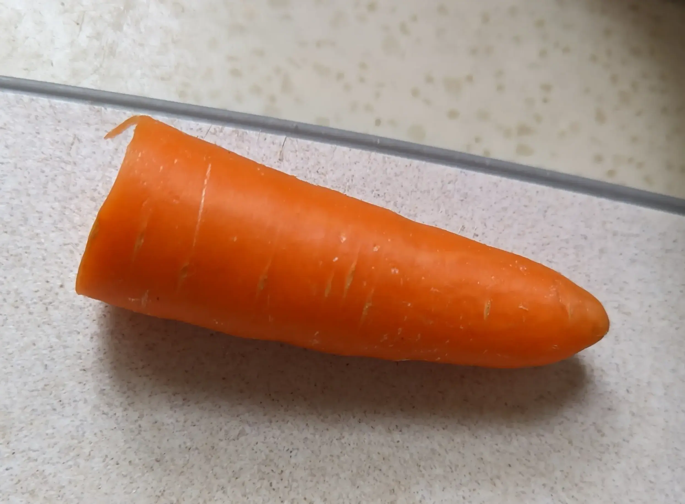
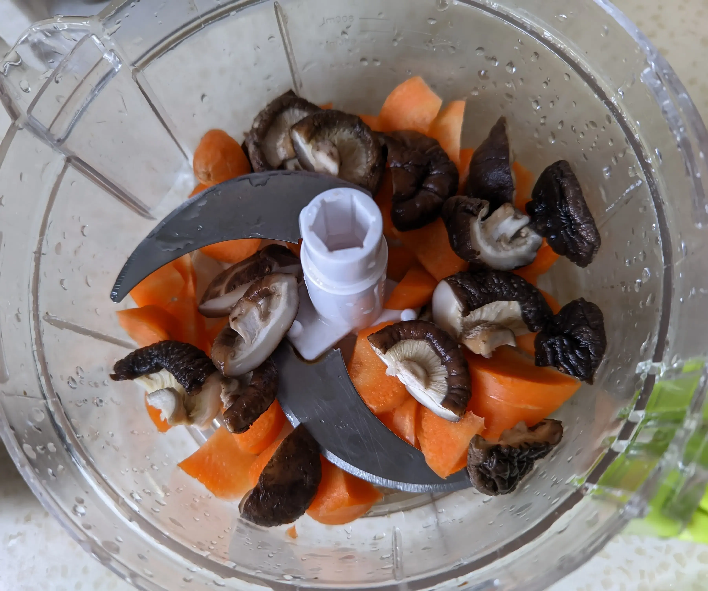
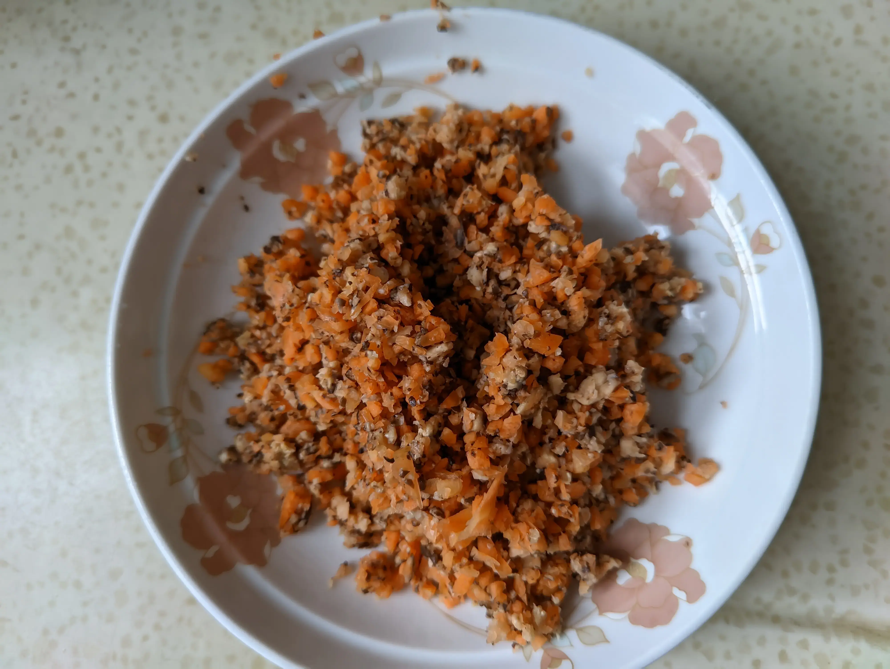
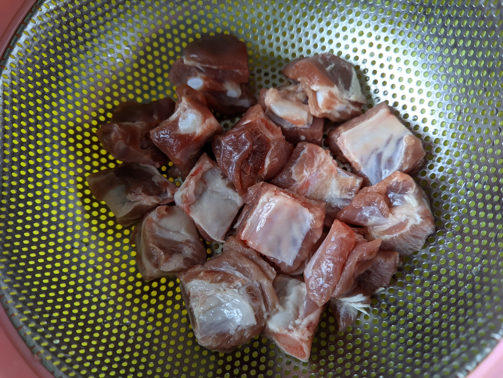
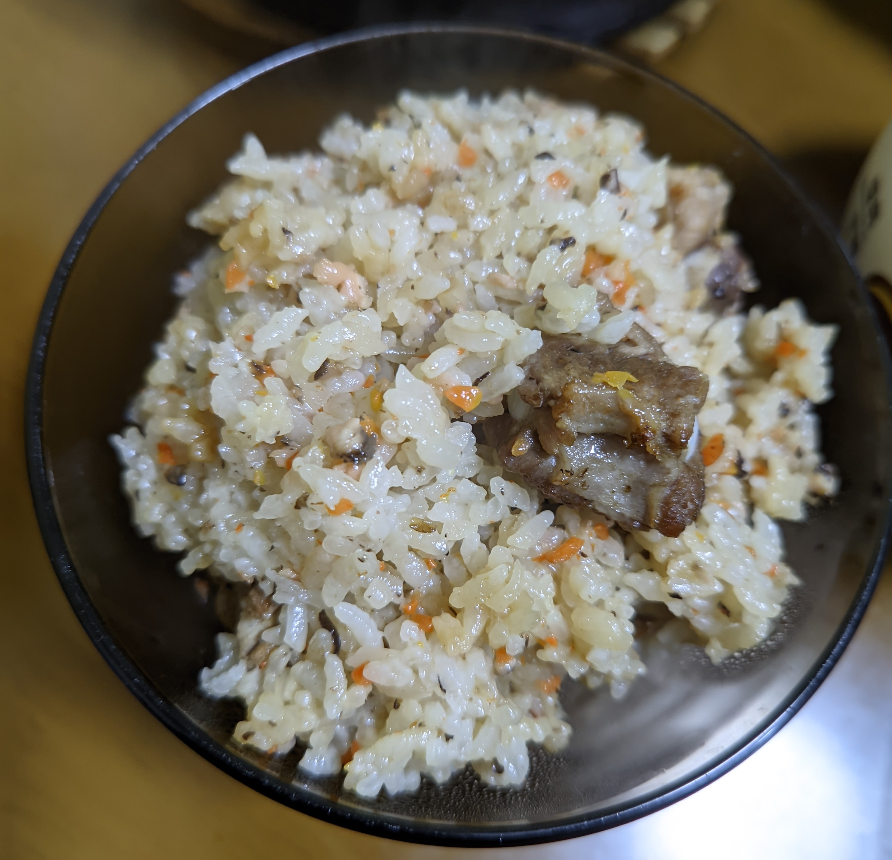

## 准备材料

大概需要以下东西：

- 排骨，要那种中间骨头比较细的，这样的排骨也可以做糖醋排骨
- 胡萝卜
- 香菇
- 肉
- 饭

还需要能把胡萝卜和香菇打成碎片的工具

## 磨香菇和胡萝卜

首先，香菇要泡开，剪小（一剪二），泡开之后洗干净。

然后，把胡萝卜大概切这么多，然后切成块，和香菇一起放在机器里磨成丁。

磨完之后大概就长这个样子

## 腌制排骨

首先要把排骨切成大概下面图片里的大小

洗干净了之后，放点盐（大概放半勺，那种小小的取盐 糖之类的勺子）

然后再放两勺黄酒（这个勺是平时吃饭用的勺子），搅拌均匀然后放着，大概放几个小时吧

## 起油锅

首先准备好一些生姜（切成条）和葱。

放点油，把胡萝卜和香菇丁放进锅里，放一点盐，稍微炒一下。然后放回盘子里。

然后放点油，把生姜和葱放进去，再把腌好的肉放进去煎。大概每隔一分钟把每块肉翻个身，大概翻了四次，煎到「两面金黄」（意思是稍微有一点焦）就可以了。

油都不需要太多，因为肉里自带油，炒胡萝卜之类的也不需要太多油

最后煎好的肉像这个样子

> 提示：姜要刮皮

## 开电饭煲

淘米，放好水，然后把上一步炒好的胡萝卜和香菇先放进去，再把肉一块一块均匀的夹进电饭煲的锅里。

（要是你们吃葱和姜，也可以试试把葱和姜也放进去（x

这时候就可以开电饭煲了，然后要等一阵子

然后，再快好的时候，放一点酱油，拌均匀，压压平

再闷一会儿，就可以吃啦

## 最终成品！

## 参考资料

我妈教的，我也不知道她参考了什么（x
