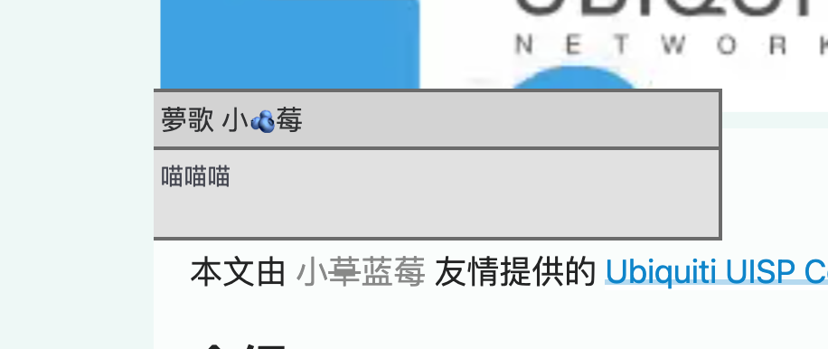
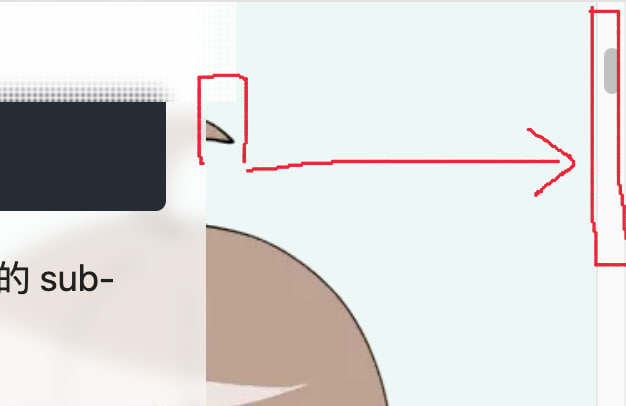

感谢 [Menci](friend:menci) 在这个过程中一些操作的指导

⬆现在的效果就像上面的链接一样

## 准备工作

### 自动确立链接的配色

原先，我的 blog 中有两种链接配色，一种是普通的链接，一种是到站内其他文章的链接。它们分别是蓝色文字加淡蓝和白色下划线以及绿色文字加淡绿和白色下划线。鼠标移上去之后分别悬浮显示链接的目标或者链接到的文章标题。

原先文字和下划线的配色分别是 #0284C7 #BAE6FD 和 #10B981 #A7F3D0 

现在我需要给定一个文字颜色自动计算一个比较淡的下划线颜色。于是我将 box-shadow 的颜色设定为了 `color-mix(in srgb, var(--linkColor) 30%, white)`，算出来的颜色也差不多

### 用 ID 标识朋友

之前友链的 [friends.yaml](https://github.com/Clansty/nyac.at/commit/0a5c0869f62a07cfc9ffdd8745db71b122c50f7f?diff=unified&w=1#diff-3c1dff7988ae0f22661143ae13665b284e2ab7371cf4ebdbdf00d65a73a22652) 中使用 avatar 来标识头像，会在 friend-avatars 中寻找对应的 webp 文件来作为头像。于是我就直接把这个字段改成 id 了。所以现在在文章中创建一个朋友链接的方法是 `[显示名称](friend:id)`

## InlineFriendLink 组件

由于 mdx 可以自定义 markdown 渲染的格式组件，所以我就让 `friend:` 开头的链接渲染成一个自定义的 `InlineFriendLink` 组件，里面显示一个对应颜色的链接并在某个位置隐藏一个友链框的组件。

## 对比度处理

由于我给一些人设定的主题色较淡（主题色一般是从头像颜色中提取的），对比度会比较差。

在 npm 上找到了一个 [color-contrast](https://www.npmjs.com/package/color-contrast) 库用来计算对比度。对比度低于 2 的话就对颜色进行一些处理

于是我还是使用混合一种较深的颜色的思路把颜色变深。不过发现如果混合黑色的话，颜色会显得有点脏。混合靠近主题色的深绿或者深蓝的话，颜色会改变的较多

最终我还是选择了[增加 10% 的黑色](https://github.com/Clansty/nyac.at/commit/0a5c0869f62a07cfc9ffdd8745db71b122c50f7f?diff=unified&w=1#diff-6a810c647db21a359c8c3ed05e138e7f7bdaec16f9e5ff1ea553760c23037558R36)，但是应用于对比度低于 1.5 的颜色。1.5 到 2 之间到我觉得很能看了，就不管了

## 定位友链框

这个问题有两种思路，一种是用 Teleport 传递到 body 下，并且使用相对于页面的绝对定位。还有一种是把链接放到一个 span 里并设置 `position: relative`，友链框相对于链接定位

前者的问题在于，获取相对于页面的位置要用到 `getBoundingClientRect()`，在 computed 中使用不会得到响应式的刷新。于是，在文章页进入动画刚开始的时候位置就被计算了，并且滚动之后新的位置不方便重新计算

于是我还是用了 [relative 的方式](https://github.com/Clansty/nyac.at/commit/0a5c0869f62a07cfc9ffdd8745db71b122c50f7f?diff=unified&w=1#diff-6a810c647db21a359c8c3ed05e138e7f7bdaec16f9e5ff1ea553760c23037558R28)计算，并且在超过屏幕最左边的时候特殊处理让友链框不超过屏幕

### 解决横向超出滚动容器的问题

由于在电脑的宽屏上我使用了中间那部分作为滚动容器，而友链框超出之后，[会被截断](https://fb7409bc.homepage-vue3.pages.dev/posts/uisp-console-chuang)

而我的外层容器是用于滚动的，无法取消任何的 `overflow: hidden`，并且暂时没有找到任何办法绕过这个问题。于是，只能[计算容器内部的边距](https://github.com/Clansty/nyac.at/commit/f305ae826e3088e895a057219c3450c3e5d127fe)让友链框在滚动容器内部。但是这样在大屏上看起来又[不是很好看](https://9c379831.homepage-vue3.pages.dev/posts/uisp-console-chuang)

然后 [Menci](friend:menci) 提到了 [popper](https://github.com/floating-ui/floating-ui) 这个库，尝试后发现实现方法和我原先的并无区别。所以并未使用

以及我甚至之前 star 过这个库，现在一点印象都没有

## 给滚动容器添加 padding 解决问题

由于在 padding 范围中的内容并不会被 overflow 隐藏，于是尝试给滚动容器添加 padding 来解决问题。

由于把滚动容器和外层一个个都修改太麻烦了，我选择把滚动容器设为 `position: fixed` 并单独计算 padding。这并没有增加新的问题。原先的设定是屏幕超过一定宽度时容器设定固定宽度，现在改成了[用 css 计算 padding](https://github.com/Clansty/nyac.at/commit/a985f93348d9bb2d7faba2c99eebc51282daf7f1#diff-309330890e50306761724268b7bbe9edf03b2f7cd9e2b84af5d9a07a4551027fR46)

每次修复一个问题就会出现一个新的问题。这时出现了一个新问题：滚动条被硬生生移到了屏幕最右边，而容器右边直接空出一个滚动条的宽度

如果将滚动条宽度设为 0，左侧的空白将消失，但是我将失去滚动条

曾经做过[这样的 fix](https://github.com/Clansty/nyac.at/commit/26586815bcb6e028a751cf58d6a029ec3bb89679)，因为别人说我的网站上鼠标只能在滚动容器内滚动很难受。于是我就在屏幕底部加了一个空白的 div，高度和主滚动容器一致但是隐藏滚动条。这样鼠标在外面滚动的时候可以通过 js 来同步滚动

然而现在这个样子，滚动容器直接是全屏了。但是我们可以利用一下这个外层的滚动容器，尝试了在内层不显示滚动条，滚动条全都让这个外层虚拟滚动容器来显示

结果是，在我这次带出来的这台 [ThinkPad X1C 6](ventoy-opencore-multiboot) 上滚动内层容器外层的滚动条一卡一卡的，而在外层滚动的时候内层的滚动还挺流畅。我觉得应该是内层的元素复杂度过高，影响了性能

但是我也没有想出什么更好的解决方法。于是思考了一下，决定能用原生滚动条就用内层容器的原生滚动条。只有[在文章内页并且屏幕够宽](https://github.com/Clansty/nyac.at/commit/a985f93348d9bb2d7faba2c99eebc51282daf7f1#diff-9a69bd3a8dc2f62c4e1b41ca38dd97d5c3a9fbef5254762eb97fb37b7560fe86R18)的时候把滚动条放在虚拟滚动容器上

以及 这个时候其实主要的文章容器覆盖在了虚拟容器上面，同时还要加一个 css 调高滚动条的 `z-index`

我也试过使用 naive-ui 的 ScrollBar，但是性能甚至不如这样，并且有奇怪问题

## 结束

目前大概就是现在的效果了，目前暂时没有发现什么新引入的问题。如果感兴趣具体的实现方式，可以去查看[这些 commit](https://github.com/Clansty/nyac.at/commits/main/?since=2023-12-10&until=2023-12-11)

同时感谢我的朋友们，因为有了你们我才能天天开心。我们还要继续走下去qwq