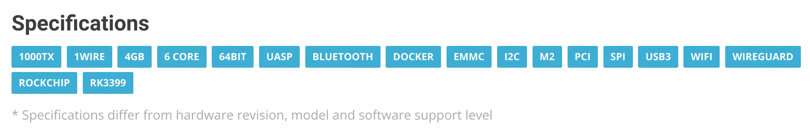

如果直接想要可以刷入的镜像的话，请点击[这里](/files/Images/Armbian/Armbian_22.05.4_Nanopi-r4se_jammy_current_5.15.48.img.zst)。这个打包好的镜像并没有测试，因为我安装的时候是手动安装的。

我买了一个 [NanoPi R4SE](https://wiki.friendlyelec.com/wiki/index.php/NanoPi_R4SE/zh) 准备用来做软路由，希望使用基于 Ubuntu 的系统。我个人比较喜欢 [Armbian](https://www.armbian.com/)。

由于 R4SE 多了一个 EMMC，而目前网上并没有什么专门适配了 R4SE 的第三方固件，所以有被<a onclick="alert('我这不是在自己创自己吗？ ——Icenowy')">创</a>到。

## 过程

### 使用 R4S 的镜像

首先我尝试使用 [R4S 的 Armbian 镜像](https://www.armbian.com/nanopi-r4s/)通过内存卡启动。然后网卡闪灯了，我觉得大概是启动完了，但是在内网中并不能找到新出现的设备。

然后我给 R4SE 接上了 TTL 串口，发现系统跑到了 initrd 里面卡住了，因为找不到根目录所在的设备。然后我发现 `/proc/partitions` 里面什么分区都识别不到。所以我觉得大概是 R4SE 的设备树和 R4S 不一样。

我下载了官方的镜像。官方镜像使用的是 [rocichip miniloader](https://opensource.rock-chips.com/wiki_Boot_option) 而不是主线 uBoot，分区结构类似安卓，没法直接提取设备树之类的。我暂时也懒得研究它，就临时写入内存卡启动后尝试直接将 R4S 的镜像写入 EMMC。

这次，是 uBoot 认不出存储设备了，直接尝试从 tFTP 下载内核。所以，R4S 的 uBoot 肯定是用不了了的。

### 官方镜像

官方似乎 R4S 和 R4SE 用的是一套镜像，可以从内存卡或 EMMC 启动。然而，我启动官方的 Ubuntu 镜像之后，发现它的根目录竟然是 overlay。瞬间不想用了。官方镜像也不能给我什么思路，因为 bootloader 根本不一样。

### 寻找其他相似设备的镜像

然后，我从 Armbian 的官网上找到了 [NanoPi M4 V2](https://www.armbian.com/nanopi-m4-v2/) 这个设备。它也有 EMMC，并且也是 RK3399。



然后我向内存卡写入它的镜像，成功启动！

不过，它的接口定义似乎不太一样，比如说串口。Systemd 的启动信息就没有正常输出。

于是我在写入 EMMC 并且确定能启动之后，将数据分区换成了 R4S 镜像的数据分区，uBoot 保留 M4 V2 的 uBoot，于是它就正常工作了。

## 手动安装的方法

大致过程如下：（在从内存卡启动的系统上进行）

```bash
xzcat Armbian_22.05.4_Nanopim4v2_jammy_current_5.15.48.img.xz | dd of=/dev/mmcblk2 bs=4M status=progress
losetup -rP /dev/loop0 Armbian_22.05.4_Nanopi-r4s_jammy_current_5.15.48.img
dd if=/dev/loop0p1 of=/dev/mmcblk2p1 bs=4M status=progress
```

（其实也可以写入 R4S 镜像之后替换 bootloader，而这需要计算 offset，比较麻烦，并且容易出错。所以这里就替换可读取的分区了）

## 缺陷

替换 uBoot 之后系统识别设备型号会不一样，比如说 neofetch 里。


附上 [Geekbench 跑分](https://browser.geekbench.com/v5/cpu/16864334)，看起来跑的比别人的高？大概是因为别人是 Android 吧。