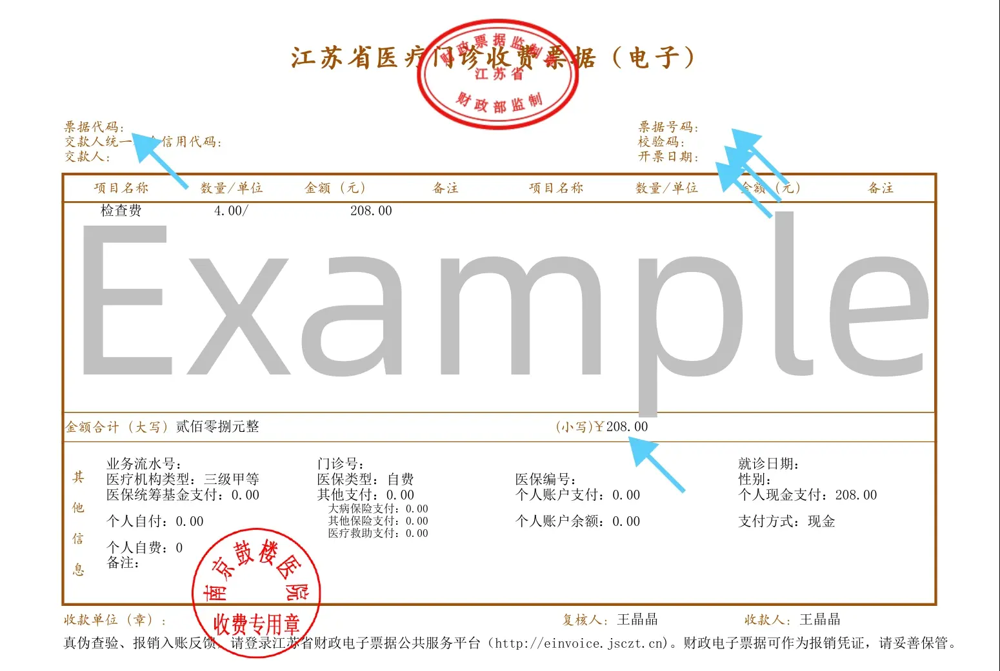
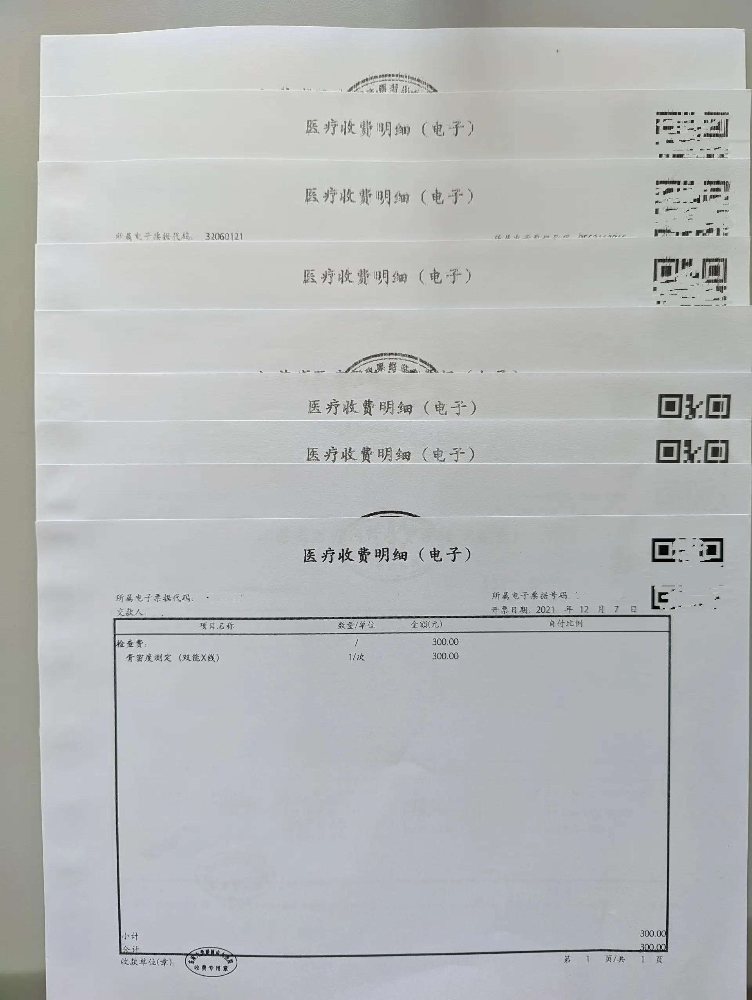
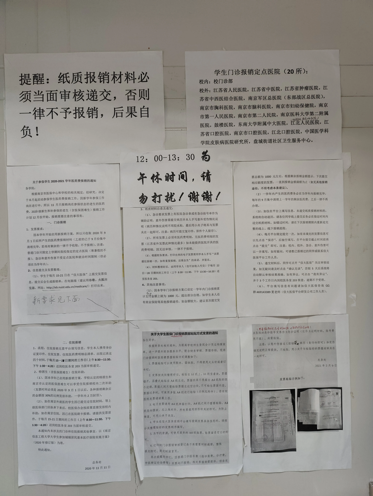

虽然标题上写的是六项费用不过这可以算是一个完整的[南京信息工程大学](https://0w.al/nuist)医保报销平台的用法。无论你是测六项还是生化还是开药看[曹阿姨](https://mtf.wiki/zh-cn/docs/psyco/yangtze/cao-qiuyun/)做量表的费用都可以报销。

## 前提

首先你就诊的医院必须是南信大的医保定点医院，一共有二十所。具体有哪些可以看最下面的图。

然后如果你是上一学年就诊的，那就最晚只能在下个学年开学的第一个月进行报销。

每学年似乎只能获得最多 1000 元的报销

挂号费（诊察费）不能报销。

> PS. 「诊察费」和「检查费」是不一样的，「诊察费」指的是挂号费用，「检查费」可能是你在曹阿姨那里做量表的费用

## 获得发票

有些医院提供发票自助打印机，刷挂号用的卡就可以获得发票了。

也有些医院提供的收费小票上有一个二维码，扫码之后可以下载到一个 PDF 文件。应该会是一页发票一页明细的样子，这两个都是要的。可以缩印，比如说通过截个图贴到 Word 里的方法。但是挂号费的发票就不需要了，因为它并不能报销。

## 添加发票信息

首先，进入[这个页面](http://eb.nuist.edu.cn/medicare)，登录。

然后点击「我要报销」那个按钮，再点击「校外门诊」右边的「添加发票」按钮，将「发票类型」设置为「电子发票」，其他所需的信息都可以直接在发票的第一页上找到。

填写完成之后保存草稿，因为大部分时候并不能提交。

## 提交申请

等到下一次 15 号的到来，在 21 号之前，你可以在网站上提交申请。如果你填写的时间正好在这个月的 15 号和 21 号之间，那么可以直接提交。

然后网页会生成一个可以打印的东西，点击打印，然后把内容保存为 PDF 到手机上，然后可以和需要打印的发票一起打印出来了。

## 提交纸质材料

首先你需要准备好所有的发票和打印的申请表。如果医院那边打印的发票不是 A4 大小的，需要把它像下面的图一样贴在 A4 纸上，沿着左边堆叠着贴就可以了。如果没有粘贴工具，可以去医保办公室贴。

等到 22 号到 28 号之间，把材料交到校医院那栋楼楼梯上二楼第一个房间。

## 确认报销信息

提交完纸质材料之后可以过几天就去网页上看看。工作人员可能会对你的材料进行审核，删除掉不能报销的金额，然后网页上会显示为待确认的状态。这时候你需要点进去然后点击确认按钮。这可能需要很久。

这接下来就没你的事了。又过了很长一段时间，网页上这条记录会变成已完成的状态。然后，你还需要等待很长一段时间，之后钱会自动打到你的农行卡上，然后就没有然后了。

## 具体的规则

这是医保办公室门上贴的东西，包含一些具体的条例，可以参考

