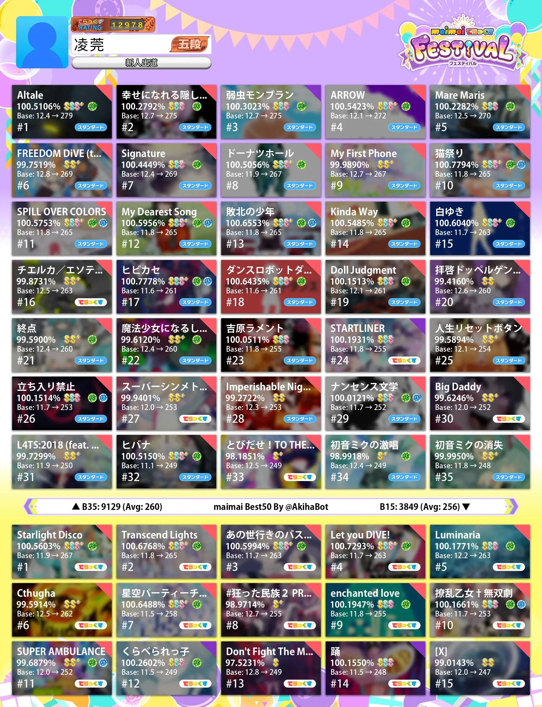
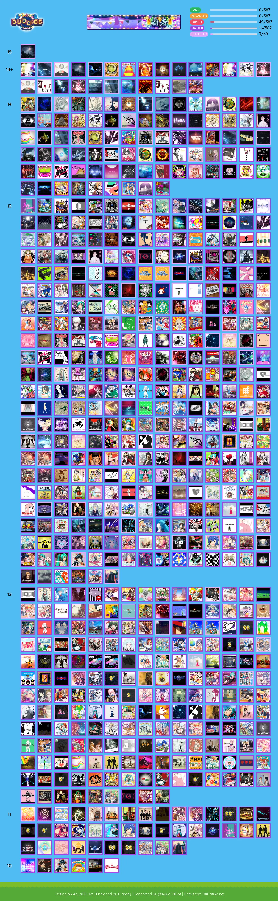

最近正在给 [AquaDX.Net](https://aquadx.net) 制作一个像其他 maimai QQ / Telegram bot 一样的 Telegram 机器人。像以前一样，我选择用基于 Cloudflare Workers 平台制作。大多数的 maimai bot 都有生成图片的功能，因为传统的文字消息无法输出排版复杂的图文内容，比如说下面的成绩图表之类的。



然而我查了一圈，在 Workers 上[并没有 Canvas 支持](https://community.cloudflare.com/t/rendering-svg-using-canvas-with-cloudflare-workers/90952)，在短期内也[没有计划](https://github.com/cloudflare/workerd/issues/54)加入支持。能搜到的一些相关文章讲的方法是[直接进行像素级别的操作](https://github.com/colecrouter/cloudflare-workers-image-generation-example)来处理图片。不过好在 Cloudflare Workers 不知道什么时候[推出](https://blog.cloudflare.com/browser-rendering-api-ga-rolling-out-cloudflare-snippets-swr-and-bringing-workers-for-platforms-to-our-paygo-plans)了一个 Browser Rendering 功能，可以在 Workers 环境下使用 Puppeteer 控制无头浏览器执行工作，并且[目前暂时没有对付费计划用户额外收费](https://blog.cloudflare.com/browser-rendering-api-ga-rolling-out-cloudflare-snippets-swr-and-bringing-workers-for-platforms-to-our-paygo-plans#:~:text=Browser%20Rendering%20is%20now%20available%20to%20all%20customers%20with%20a%20paid%20Workers%20plan.%20Each%20account%20is%20limited%20to%20running%20two%20new%20browsers%20per%20minute%20and%20two%20concurrent%20browsers%20at%20no%20cost%20during%20this%20period.%20Check%20our%20developers%20page%20to%20get%20started.)。

## 将 HTML 转换为图片

在 Workers 中使用 Browser Rendering 将 HTML 代码直接渲染为图片只需要安装 Cloudflare 定制版 Puppeteer

```sh
pnpm add @cloudflare/puppeteer
```

然后在 wrangler.toml 里面加入一个 browser 的绑定

```toml
browser = { binding = "MYBROWSER" }
```

我们可以直接使用 `page.setContent` 加载 HTML 的代码

```typescript
public async renderHtml(html: string, width: number) {
    const browser = await puppeteer.launch(env.MYBROWSER);
    const page = await browser.newPage();
    await page.setViewport({ width, height: 500 });
    await page.setContent(html, { waitUntil: 'networkidle0' });
    const data = await page.screenshot({ encoding: 'binary', fullPage: true }) as Buffer;
    await page.close();
    await browser.close();
    return data;
}
```

比如说 `await renderHtml("<p>test</p>", 200)` 就可以直接获得图片的 Buffer 了

## 使用 React 渲染图片的内容

由于生成的图片数据是动态的，而绘图所需的数据应该是由 Workers 传给网页而不是由网页主动获取的，也就是先有数据再生成图片。如果因此去做一个新的接口让网页去获取数据的话，就未免太麻烦了。我能想到的大概是以下的办法

- Workers 将数据写入一个临时的接口，搭建一个网站，访问的时候网站会根据 URL 中的参数去获取数据并渲染
- 写一个简单的 HTML （或者用 Vue 之类的也可以）来确定布局，HTML 里的 js 导出一个方法传入数据来渲染内容，Workers 使用 Puppeteer 在浏览器中执行这个方法传入数据
- 在 Workers 中生成纯静态的 HTML，传递给无头浏览器加载

最后我们选择了第三种方法，设计和调试起来相对比较简单。接下来就要选择生成 HTML 的方式了。拼接字符串吗？这显然太不靠谱了。如果用 EJS 之类的模板引擎的话，由于 Workers 环境不能使用 eval，可能不是很好实现。并且 Workers 环境没有文件系统，如何存取模板文件也是个问题。并且这样的方法也不是很现代，传入参数和编辑也不是很方便。

在搜索解决方案的时候我看到了一个叫做 Hono 的库，它是一个后端 Router，它有个[功能](https://hono.dev/guides/jsx)是通过 JSX 在后端渲染网页返回给前端，比如说这样

```jsx
app.get('/', (c) => {
  return c.html(
    <div>
      <ThemeContext.Provider value={themes.dark}>
        <Toolbar />
      </ThemeContext.Provider>
    </div>
  )
})
```

不过它的渲染功能和路由功能是绑定在一起的，我们其实只需要它把 JSX 渲染为 HTML string 的功能就可以了。于是我查了以下，react-dom 就有这个功能：[renderToStaticMarkup](https://zh-hans.react.dev/reference/react-dom/server/renderToStaticMarkup)

所以我们只需要将写好的 React 组件传入 renderToStaticMarkup 就可以获得想要的 HTML 字符串了，然后就只需要正常用 React 来写要渲染成图片的组件

## 调试

调试起来也很简单，只要单独开一个接口返回输出的字符串，并且把 Headers 中的 Content-Type 设定为 text/html 就可以直接在浏览器里调试效果了。Workers dev 的脚本也是保存即重新加载的

不过需要注意的是，Browser Rendering 目前还没法在本地的 Workerd 中使用，在调试图片生成的时候，需要把 Workers dev 切换到远程模式

以及，由于云端 Chromium 中的字体可能和本地不一样，最好是在网页里使用远程字体来保证和调试时候一样的效果

## 番外：在 Workers 环境下使用 Telegraf

[Telegraf](https://github.com/telegraf/telegraf) 是通过 JS 开发 Telegram Bot 时一个比较好用的库。它说是支持那些 Serverless 平台，但是 Workers 的支持似乎仅限于旧版本。最新版本还是用了一些 Node.JS 专有的东西，就算开了 node 兼容模式也不能正常运行。因此我通过 [Patch 这两个相关库](https://github.com/clansty/AquaDX-Bot/tree/8d8febc34dc4fd03e7c8b3bcc7d79a493ffe851a/patches)的方式让它能在 Workers 上运行了。

然而在发送图片的时候，由于 node-fetch 和普通的 fetch 在构造 Multi-Part HTTP 请求体的时候方法有些不一样。现在可以通过[这样的 Patch](https://github.com/clansty/AquaDX-Bot/blob/994775a89b39665b4e99aecdf1c25bb2dc4eace1/patches/telegraf%404.16.3.patch) 来让它正常工作

## 效果

现在已经完成的大概是这样子的

