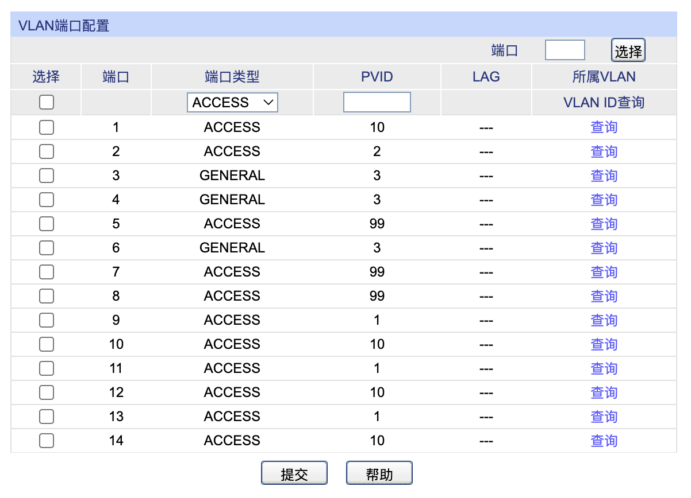
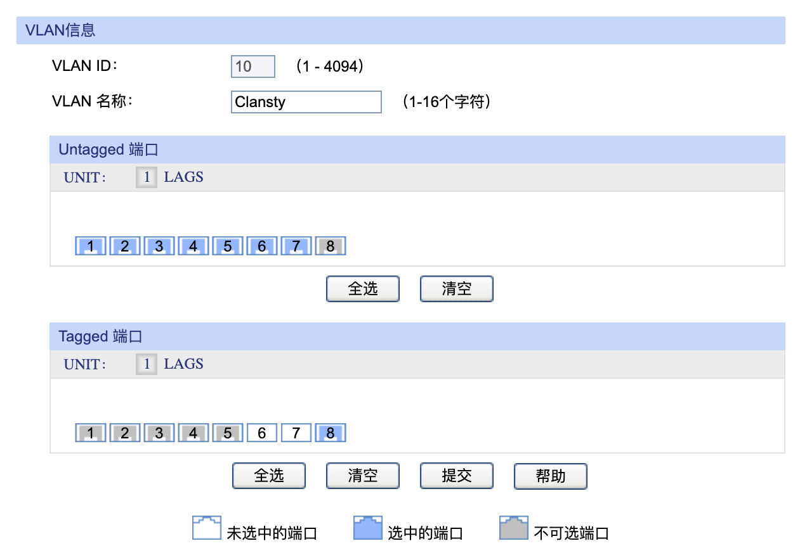
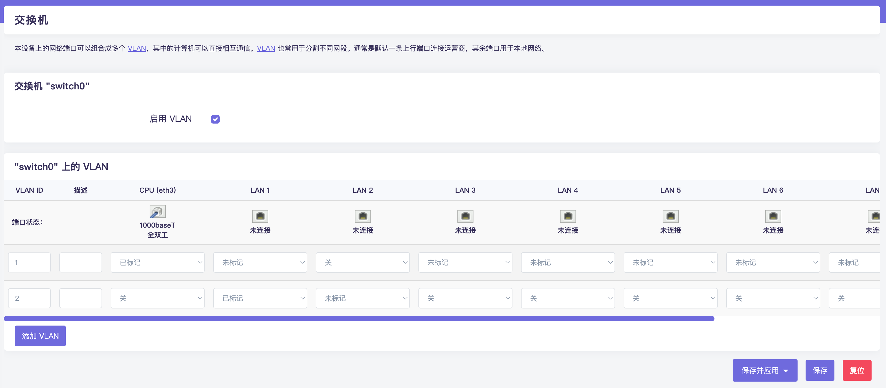

由于一些人的催更，我今天来写写拿普通 Linux 发行版做路由器的过程。之前写过一篇[用 Arch Linux 做软路由](archlinux-router)的文章，不过那里面用的技术和我现在用的不太一样，并且有过时的内容，所以我想重新写一篇。这次我是想讲讲我现在使用的技术以及还有一些更详细的东西，更通用的东西

首先我在苏州目前有两个我的路由器，最大的区别是一个是光猫拨号，一个是路由器本身拨号。

这篇文章和上一篇主要的区别是

- 这次我们使用 Debian 作为系统，为了更稳定
- 使用 clash-meta（现在叫做 [mihomo](https://github.com/MetaCubeX/mihomo/releases)）作为代理工具。下文中的 clash 和 mihomo 都指这个程序
- 使用 tproxy 而不是 TUN
- 使用 dnsmasq 管理 DHCP（不过 DNS 服务器还是用 clash）
- 使用 WireGuard 构建~~城内以太传送网~~内网间的互联

我们所有的操作都是要在终端里面用命令行进行的，包括设置和查看网络状态等。所以执行这个过程需要一定的 Linux 基础。

我们同时需要能物理操作这台设备终端的方式。因为调整的过程中可能会让我们操作的设备失去所有网络连接，从而无法再通过 ssh 访问终端。这个物理操作方式可以是显示器和键盘，可以是串口控制台。如果这台机器是一个虚拟机，我们也可以通过母机上的管理程序来操作它。

开始这一切之前，我们需要先确保 `iproute2` 这个包已经是安装好了的。`ip` 这个命令将会贯彻始终，如果下面需要的时候才发现可能会比较麻烦。比如我们经常需要用以下命令检查自己的 IP 地址设置

```bash
ip addr
```

## 配置网络接口

我们仍然使用 [systemd-networkd](https://wiki.archlinux.org/title/Systemd-networkd_(简体中文))。在这之前，我们需要确保所有其他网络管理程序处于停止状态。

```bash
systemctl status networking NetworkManager dhcpcd
```

如果其中任何服务处于启用状态，我们需要 disable 它

然后我们需要启用 systemd-networkd

```bash
sudo systemctl enable systemd-networkd
```

执行 enable 或者 disable 操作并不会启动或者停止服务，而是改变它的开机自启设置。这对通过 ssh 连接目标机器的情况比较有用，因为这样不会导致丢失网络连接。可以等配置完之后重启机器，这样就会自动启动新的服务

如果目标机器没有 IP 地址，我们也可以先手动设置一个临时的地址用于设置的过程中使用 ssh 连接

```bash
sudo ip addr add 192.168.10.1/24
```

然后连接用的机器也设置同一网段下的不同 IP 地址，就可以互访了。不过在这个设置的过程中，我们很可能需要联网下载安装软件包。如果要在断网的状态配置的话，可以提前先把所有需要的软件安装好，再执行配置

我们接下来所创建的文件全都在 `/etc/systemd/network` 这个文件夹下，这是 `systemd-networkd` 的配置目录。如果这里面已经有文件了，我们应该清空它们

### 设置接口别名

很多时候我们默认的接口名称可能长得像这样

```plain
enp17s0 en0 eth0 enp0s26u1u2
```

我们可以用 .link 结尾的文件来修改接口的名称

顺便，由于加载配置文件的时候是以文件名的顺序加载的，我们一般在文件名前面加两位数字来让它有顺序

```bash
sudo -e 10-lan.link
```

```ini
[Match]
MACAddress = 00:11:22:33:44:55
Type = ether

[Link]
Name = lan
```

这里的 mac 地址要和 `ip a` 看到的接口物理 IP 地址一样。这样 MAC 地址匹配的连接就会被命名为 `lan`

### 设置 VLAN 接口

如果作为路由器的设备只有一个网口，或者我们只想用一个网口，但还是希望它像一个正常路由器一样工作（非旁路由），我们可以通过 VLAN 来实现类似单线复用的效果。

要使用 VLAN，我们一般需要一个支持 VLAN 的交换机。可以是一个正常的交换机，也可以把一个运行 OpenWRT 的路由器用作交换机。只要它可以一个接口接我们的设备，一个接口接光猫（或者猫棒），一个接口接作为 AP 的设备（当然如果用作交换机的这个设备本身自带 Wi-Fi 发射功能，也可以不需要），并且可以配置 VLAN。





不同的交换机配置的方法很可能不太一样，具体需要以交换机的说明为准。



总之，如果通过 VLAN 模式实现单臂路由的话，我们可以使用 VLAN untagged 作为 LAN 网络，将光猫的网口作为 tagged 传入单臂路由。就像这最后一张图所示，VLAN ID 1 可以是 LAN 网络，VLAN ID 2 用于连接光猫。接口 1 2 3 分别连接我们的设备、光猫、AP。

此时我们像这样在我们的路由器上通过 VLAN ID 2 连上光猫的网。首先通过 .netdev 的文件创建一个类型为 VLAN 的接口。

```bash
sudo -e 10-modem.netdev
```

```ini
[NetDev]
Name = modem
Kind = vlan
MACAddress = 00:11:22:33:44:52

[VLAN]
Id = 2
```

这里的 MAC 地址可以由我们自己定义，可以随意填写，但是最好不要和别的接口以及网络里的其他设备冲突。

在上图的情况下，我们用于连接光猫的 VLAN 和上文中定义的 lan 共用一个物理接口。然而这个文件并没有定义这个 VLAN 使用哪个物理接口。这需要在物理接口关联的 .network 文件中定义

```bash
sudo -e 30-lan.network
```

```ini
[Match]
Name = lan

[Network]
VLAN = modem
# VLAN = tr069 # （同一物理接口加入的 VLAN 可以定义多个）
```

.network 文件还需要用来定义 IP 地址之类的信息，这个将在下面描述

这时候我们已经将内网和外网的物理接口定义好了

### 设置内网的 IP 地址

设置 IP 地址用的也是 .network 的文件

```bash
sudo -e 30-lan.network
```

```ini
[Match]
Name = lan

[Network]
Address = 192.168.10.1/24
# VLAN = modem # （如果需要绑定 VLAN 接口）
```

对于内网，我们不需要设置网关之类的服务器，所以只需要写上地址和子网掩码就行（[子网掩码呢？](https://nolebase.ayaka.io/%E7%AC%94%E8%AE%B0/%F0%9F%9B%A0%EF%B8%8F%20%E5%BC%80%E5%8F%91/%F0%9F%95%B8%20%E7%BD%91%E7%BB%9C/IP%20%E5%90%8E%E9%9D%A2%E7%9A%84%E6%96%9C%E6%9D%A0%E6%98%AF%E4%BB%80%E4%B9%88%EF%BC%9F.html)）

### 设置到光猫的连接

#### 光猫拨号的方案

#### 路由拨号的方案

### 作为旁路网关的设置方案


关于 systemd-networkd 的用法还有很多，可以参考 [Arch Wiki](https://wiki.archlinux.org/title/Systemd-networkd_(%E7%AE%80%E4%BD%93%E4%B8%AD%E6%96%87)) 以及阅读手册（不过这样的话可能需要面临大量紧凑的英文内容）

```bash
man systemd-networkd
man systemd.netdev
man systemd.link
man systemd.network
```

## 配置 DHCP 服务器

这次，我们使用 dnsmasq 作为 DHCP 服务器，并且关闭 dnsmasq 的 DNS 服务器功能，因为接下来我们要用 clash 作为 DNS 服务器

```bash
sudo apt install dnsmasq
sudo -e /etc/dnsmasq.conf
```

dnsmasq 的配置文件中指定的是不需要开启 DHCP 的接口名称。所以我们需要将不需要开启 DHCP 的接口都写上，只留一个 lan

```ini
no-dhcp-interface=modem
no-dhcp-interface=tr069

port=0
```

`port=0` 的意思是关闭 DNS 服务器功能，只保留 DHCP 服务器的功能

接下来只需要设置一些 DHCP 相关的参数

```ini
dhcp-range=192.168.10.150,192.168.10.200,48h
dhcp-option=option:netmask,255.255.255.0
dhcp-option=option:router,192.168.10.1
dhcp-option=option:dns-server,192.168.10.1
# dhcp-option=option:domain-search,c5y.moe # （这个用于设置「搜索域」，有需要的话可以设置）
```

然后可以启动 dnsmasq 服务

```bash
sudo systemctl enable --now dnsmasq
```

请注意，一个网络内 DHCP 服务器只应该存在一个。如果你使用别的路由器作为 AP，或者使用的交换机或 AP 有 DHCP 功能，或者在调试时启动了什么临时的 DHCP 服务器，请记得关闭

当然，你也可以不在这台软路由上安装 DHCP，而是使用作为 AP 的路由器，或者是带有 DHCP 功能的交换机或者 AP 做 DHCP 服务器。这样的话就在作为 DHCP 的设备上设置下发这台软路由的地址作为网关和 DNS 地址

可以通过查看 dnsmasq 的日志来了解连入的设备情况

```bash
systemctl status dnsmasq
journalctl -xeu dnsmasq
```

## 配置 PPPoE 连接

这段内容只适用于使用路由拨号的方案

## 安装和配置 Mihomo

### 获取二进制

访问 [Release 页面](https://github.com/MetaCubeX/mihomo/releases/latest)获取下载地址，对于大多数 x86 设备，我们一般下载普通的 amd64 版本。然后，我们一般[将自行安装的二进制放在 /usr/local/bin](https://refspecs.linuxfoundation.org/FHS_3.0/fhs/ch04s09.html)，并且授予可执行权限

```bash
wget https://github.com/MetaCubeX/mihomo/releases/download/v1.18.0/mihomo-linux-amd64-v1.18.0.gz
gunzip mihomo-linux-amd64-v1.18.0.gz
sudo mv mihomo-linux-amd64-v1.18.0 /usr/local/bin/clash
sudo chmod +x /usr/local/bin/clash
```

<iframe src="https://app.warp.dev/block/embed/arvi0webcctsj90L2dhBJY" title="embedded warp block" style="width: 100%; height: 226px; border:0; overflow:hidden;border-radius:0.3em" allow="clipboard-read; clipboard-write"></iframe>

### 制作配置文件

### 下载面板文件

### 设置 tproxy 代理

### 创建 systemd 服务

## IPv6 相关配置

### 光猫拨号的方案

### 路由拨号的方案

#### 通过 dnsmasq 下发 slaac

## 通过 WireGuard 进行异地组网