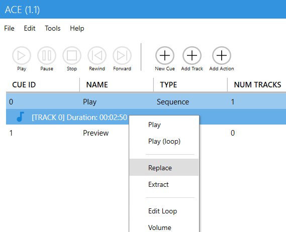
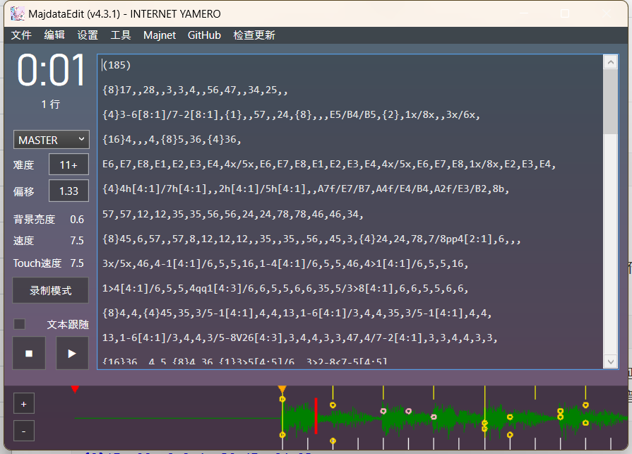
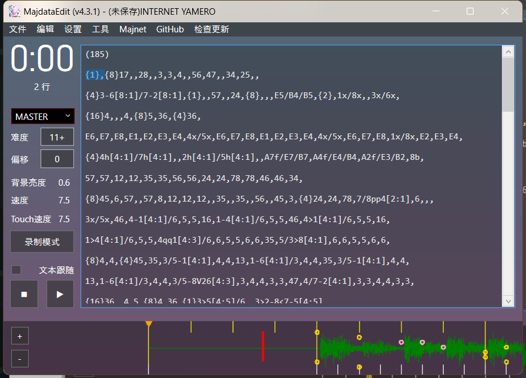

要把自制谱或者其他 Simai 谱面转换成官机的格式，也就是要转换以下这些东西：歌曲的基本信息，音频，谱面本身，封面和 BGA。它们在 Simai 的格式中一般以以下方式存在：

- 基本信息、谱面：`maidata.txt`
- 音频：`track.{mp3,ogg,…}`
- 封面：`bg.{jpg,png,…}`
- BGA：`pv.mp4`

然而在官方程序的数据中，它们应该以以下的方式存在

- 基本信息：`StreamingAssets\Axxx\music\music0xxxxx\Music.xml`
- 谱面：`StreamingAssets\Axxx\music\music0xxxxx\0xxxxx_0[难度].ma2`
- 音频：`StreamingAssets\Axxx\SoundData\music00xxxx.{acb,awb}`
- 封面：`StreamingAssets\Axxx\AssetBundleImages\jacket\ui_jacket_00xxxx.ab{,.manifest}` 同时，还需要 AssetBundleImages 的 manifest 中注册
- BGA：`StreamingAssets\Axxx\MovieData\00xxxx.dat`

几乎所有的资源格式都不一样。然而基本信息、谱面、音频对于游玩来说是必须的。所以我们需要针对不同的格式逐个转换它们。在这之前，我们需要先想一个稍微大一点的四位数 ID 作为这首歌的 ID，比如说这里就以 5000 为例

本文所述内容仅供学习研究，游戏及音乐等的版权由原作者所有。如果认为本文章侵犯了你的权利，请联系我

## 准备资源文件夹

在 `Sinmai_Data\StreamingAssets` 文件夹下，可以有多个以 "Axxx" 为名的文件夹，只涉及资源的小版本更新（opt）就是通过在这里创建新的资源文件夹来工作的。所以我们可以在这里创建一个自己的文件夹，比如说 "A500"

## 转换音频文件

maimai 的音频文件使用 CRIWARE HCA 编码，包装在 ACB 容器里。要编辑 ACB 文件，我们可以使用 [Audio Cue Editor](https://github.com/LazyBone152/ACE) 这个编辑器。首先在刚刚创建的 opt 文件夹中创建一个 SoundData 文件夹，然后从其他的 SoundData 中复制一对 .acb 和 .awb 结尾的文件。.awb 文件存储的是 acb 中可以流式传输的音频。

使用 ACE 打开那个 .acb 的文件，可以看到里面的 Play 中有歌曲的数据，我们可以直接通过 Replace 来替换它



我们只应该选择 Path 也就是文件路径，其他选项保持不变。完成后通过菜单栏保存，文件应该命名为 `music00xxxx.{acb,awb}` 其中 xxxx 为你刚刚想的 ID

不过我们可能会需要对音乐做一些剪辑，具体情况待会儿在谱面那边讲

## 编辑配置文件

首先我们知道 maimai 中有两种谱面格式。一种是旧框体的标准乐谱，它是没有 touch 的。还有一种是 DX 乐谱，新框体增加了一些触摸区域以及 touch、绝赞星星等新的音符。在程序内部和数据的很多地方，会通过六位数的 ID 的左边第二位是不是 1 来区分是不是 DX 乐谱。所以说音乐的 ID 只是四位

在第一步创建的 opt 文件夹中新建 music 文件夹，里面再新建 music0xxxxx 这个文件夹，这里的 xxxxx 是刚才所说的区分是标准乐谱和 DX 乐谱的标志位和你想的四位数 ID。文件夹里暂且先从别的文件夹里复制一个 Music.xml 过来

现在我们来讲讲这个 Music.xml 是怎么写的。我们只需要关注以下这几个地方，其他地方都不要管，也不太需要改动，影响不大

```xml
  <dataName>music011692</dataName>
```

这里改成和文件夹的名字一样

```xml
  <name>
    <id>11692</id>
    <str>INTERNET YAMERO</str>
  </name>
  <artistName>
    <id>1692</id>
    <str>Aiobahn feat. KOTOKO</str>
  </artistName>
  <genreName>
    <id>101</id>
    <str>POPSアニメ</str>
  <bpm>185</bpm>
```

这些地方就是顾名思义，其中 name 处如果是 DX 的谱面，就填写五位的 ID。如果不是，就写四位，比如说 `1692`。你们自己想的 ID 应当是比 2000 大的，因为现在 maimai 里已经有一千多首歌了。

artist 的 ID 就填写四位 ID 就行，随便填也可以。

genre 要修改的话，ID 要和 musicGenre 文件夹中的对应

```xml
  <AddVersion>
    <id>100</id>
    <str>test</str>
  </AddVersion>
```

我们可以在按版本分类的试图里面新建一个我们自己的版本，只需要在 Music.xml 里面这么写，再在 opt 文件夹中建立一个 `musicVersion\MusicVersion000100` 文件夹，里面的 MusicVersion.xml 这么写

```text
A500\musicVersion\MusicVersion000100\MusicVersion.xml
```

```xml
<?xml version="1.0" encoding="utf-8"?>
<MusicVersionData xmlns:xsi="http://www.w3.org/2001/XMLSchema-instance" xmlns:xsd="http://www.w3.org/2001/XMLSchema">
  <dataName>MusicVersion000021</dataName>
  <name>
    <id>100</id>
    <str>test</str>
  </name>
  <genreName>自己加的歌</genreName>
  <genreNameTwoLine>自己加的歌</genreNameTwoLine>
  <version>50000</version>
  <Color>
    <R>110</R>
    <G>217</G>
    <B>67</B>
  </Color>
  <FileName>UI_CMN_TabTitle_MaimaiTitle_test</FileName>
  <priority>0</priority>
  <disable>false</disable>
</MusicVersionData>
```

```xml
  <movieName>
    <id>1692</id>
    <str>INTERNET YAMERO</str>
  </movieName>
  <cueName>
    <id>1692</id>
    <str>INTERNET YAMERO</str>
  </cueName>
```

接下来还有这两个，也填写四位数字 ID

```xml
  <sortName>A</sortName>
```

这个会影响到歌曲排序。如果懒的话就写个 A 好了

```xml
  <eventName>
    <id>1</id>
    <str>無期限常時解放</str>
  </eventName>
  <eventName2>
    <id>0</id>
    <str>解放なし</str>
  </eventName2>
  <subEventName>
    <id>0</id>
    <str>解放なし</str>
  </subEventName>
  <lockType>0</lockType>
```

这些地方最好是像这么写，和上面一样，不然可能会出现锁定的情况

```xml
  <subLockType>0</subLockType>
```

这一行是指定这首歌有没有白谱。就算没有白谱，写 0 也没有什么关系，只是会出现一个不可用的白谱。写 1 的话，就不算下面写了白谱，也不会显示白谱了

接下来的 `notesData` 数组有六个成员，不要删掉里面的项目，否则游戏会无法启动。每个成员都是这样一个 Notes 对象

```xml
<Notes>
  <file>
    <path>011692_00.ma2</path>
  </file>
  <level>13</level>
  <levelDecimal>0</levelDecimal>
  <notesDesigner>
    <id>999</id>
    <str/>
  </notesDesigner>
  <notesType>0</notesType>
  <musicLevelID>19</musicLevelID>
  <maxNotes>0</maxNotes>
  <isEnable>false</isEnable>
</Notes>
```

`path` 的前半段就改成带有 DX 标识的六位数 ID，后两位 0~4 分别对应 绿黄红紫白谱，而 05 不会被用到，但是也不要删除

`level` 和 `levelDecimal` 是关于 B50 计算的定数，整数部分和小数部分。作为娱乐的自制谱还是不要算进 B50 比较好，定数可以填写为 0

`notesDesigner` 的 ID 最好改成 999 之类不存在的比较大的数，str 可以自己定义，会显示出来

`musicLevelID` 需要对应 `musicLevel` 文件夹中的 ID，可以翻看那个文件夹，也可以参考下面的对应表

| 难度 | musicLevelID |
| --- | --- |
| 15+ | 24 |
| 15 | 23 |
| 14+ | 22 |
| 14 | 21 |
| 13+ | 20 |
| 13 | 19 |
| 12+ | 18 |
| 12 | 17 |
| 11+ | 16 |
| 11 | 15 |
| 10+ | 14 |
| 10 | 13 |
| 9+ | 12 |
| 9 | 11 |
| 8+ | 10 |
| 8 | 9 |
| 7+ | 8 |
| 7 | 7 |
| 7 及以下 | 它本身 |

`isEnable` 设置成 false 的话，对应难度就会禁用。如果没有谱面的话，就设置成 false

## 谱面

转换谱面我们可以使用 [MaichartConverter](https://github.com/Neskol/MaichartConverter)。命令如下：

```shell
maichartconverter compilesimai -p maidata.txt -f Ma2_104 -d 5 -o out
```

难度选项 `-d` 使用的是 simai 的难度，绿谱为 1，白谱为 5，需要自己改成要转换的难度。Ma2_104 是 FESTiVAL 之后加了多个连在一起的星星，绝赞星星之类的支持的格式

不过只有没有添加延迟的 Simai 谱面可以这么转换，而有些谱面直接这样转换会出现音画不同步的情况。打开 maidata.txt 可能能看到这样一行：

```ini
&first=1.33
```

这是表示第一个音符应该相对于歌曲开头延迟多少秒开始出现，而官方程序不支持这个，延迟只能在谱面中完成。而这个谱面看起来在真正谱面开始之后一上来就出音符了，而普通的 maimai 谱面应该在谱面中空一小节

```ini
&inote_5=(185)
{8}17,,28,,3,3,4,,56,47,,34,25,,
```

我们可以用 [MajdataView](https://github.com/LingFeng-bbben/MajdataView) 打开查看这个 Simai 谱面



这个偏移 1.33 秒就是下面的图中左边空出的那部分，(185) 为 BPM，可以通过 $60\div185\times4\approx1.30$ 来算出一小节大约有 1.30 秒，于是我们把偏移修改为 0，再在谱面最前面添加一个空白小节就可以差不多对上



然后我们把歌曲最前面删掉 0.033 秒，再转换为 acb+awb 格式放到游戏里

## 封面

在写这篇文章之前我也看过[其他人写的教程](https://www.cnblogs.com/Dinnerbone/p/16902829.html)，他们可能会把图片转换成 AssetsBundle 格式，但是我实践起来发现这非常的麻烦，不如让游戏主动加载我们 jpg / png 格式的图片，比起转换来说简单多了，只需不到 50 行[代码](https://github.com/hykilpikonna/AquaDX/blob/v1-dev/AquaMai/UX/LoadJacketPng.cs)就可以解决

安装这个 mod 之后，只需要把图片命名为六位数 ID 放入游戏目录中新建的 "LocalAssets" 目录就可以了

## BGA

游戏中的 BGA 使用的是 CRI 的 usm 格式，而 CRI 的 `CriManaMovieMaterial` 并不能直接加载 mp4 之类格式的视频。进行了一些将视频转换为 usm 格式的尝试，使用了 [WannaCRI](https://github.com/donmai-me/WannaCRI) 这个工具：

```shell
# 首先需要转换为没有容器的纯 264 格式
ffmpeg -i `F:\Maimai HDD\A500\LocalAssets\pv.mp4` pv.264
wannacri createusm --key 0x7F4551499DF55E68 pv.264
```

然而不知道是不是帧数识别之类的问题，视频的速度很快，在音乐结束前很久就结束了。不过没有 BGA 并不影响游玩，而且就算这样我们也可以把静态图片编码为视频作为 BGA。

由于这个对游玩影响不大，所以我们暂缓研究。如果后续有新的解决方案，我会在这里更新上

到现在我们已经可以比较完美的在官方程序上玩自定义的谱面了。为了简化这个过程，我正在制作一个工具来一键导入和管理谱面，敬请期待