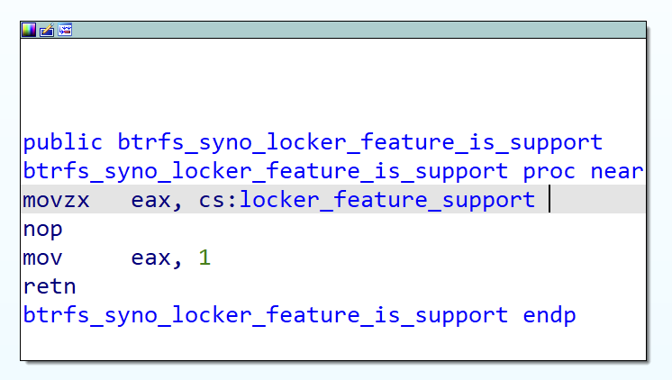
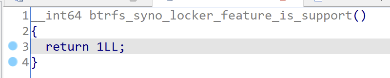
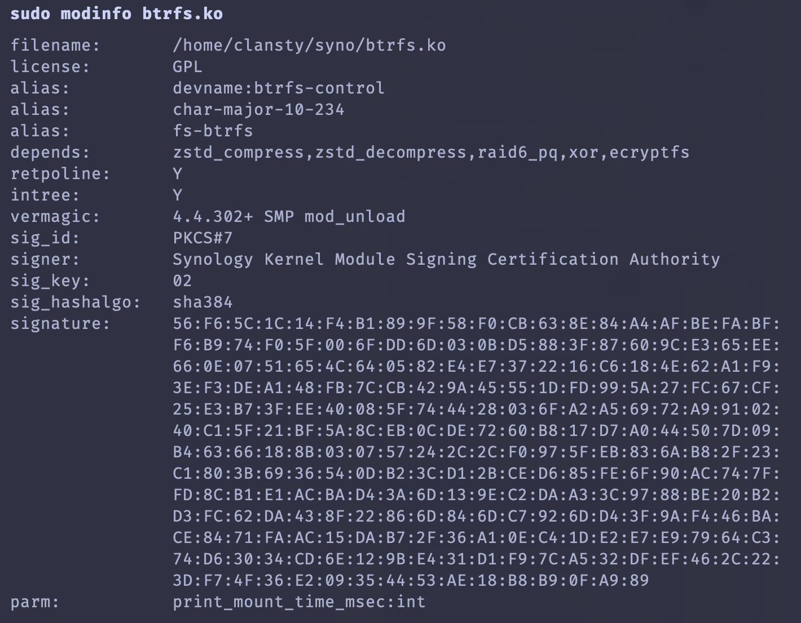

## 问题

在几个月前，我尝试把黑群晖的型号从 [DS3622xs+](https://github.com/wjz304/arpl-i18n/blob/main/files/board/arpl/overlayfs/opt/arpl/model-configs/DS3622xs%2B.yml) 换成了 [DVA3221](https://github.com/wjz304/arpl-i18n/blob/main/files/board/arpl/overlayfs/opt/arpl/model-configs/DVA3221.yml)，发现有些 Volume 变成了只读状态，并且面板里也不能设置为读写模式。进入 ssh `mount -o remount,rw`，dmesg 中提示

```plain
BTRFS error (device dm-9): cannot mount read-write because of no locker support
```

在网上搜索 `btrfs locker` 或上面的报错信息，并不能找到什么结果。在 btrfs 命令行中确实找到一个叫做 locker 的 sub-command，帮助信息如下

```plain
usage: btrfs locker <command> <path>

    btrfs locker get <object> [<property>]
        Get a locker property on a btrfs object
    btrfs locker set <object> <property> [<value>]
        Set a locker property on a btrfs object

        █    ████▄ ▄█▄    █  █▀     ██      ▄   ██▄       █▄▄▄▄ ████▄ █    █
        █    █   █ █▀ ▀▄  █▄█       █ █      █  █  █      █  ▄▀ █   █ █    █
        █    █   █ █   ▀  █▀▄       █▄▄█ ██   █ █   █     █▀▀▌  █   █ █    █
        ███▄ ▀████ █▄  ▄▀ █  █      █  █ █ █  █ █  █      █  █  ▀████ ███▄ ███▄
            ▀      ▀███▀    █          █ █  █ █ ███▀        █             ▀    ▀
                           ▀          █  █   ██            ▀

a cupboard in which you can leave your possessions for a period of time
```

并没有什么有用的信息，看起来像个 KV 存储。搜索最下面那句话只能找到这样的内容


通过 `btrfs inspect-internal dump-super` 查看了可以挂载和不可以挂载读写的卷的区别，在于 `compat_ro_flags`

```plain
compat_ro_flags		0x3
			( FREE_SPACE_TREE |
			  FREE_SPACE_TREE_VALID )
```

```plain
compat_ro_flags		0x800000000000003
			( FREE_SPACE_TREE |
			  FREE_SPACE_TREE_VALID |
			  LOCKER )
```

看起来区别是一个叫做 `LOCKER` 的 FLAG，值为 `0x800000000000000`。这个 FLAG 在正常的 Btrfs 里面是没有的，并且这个值看起来也很不标准。以及众所周知群晖在 Linux 的自带组件里面都加了不少私货。

当时 Synology 也只公布了 DSM 7.1 的内核源码，而 DSM 7.1 并没有这个设定。所以当时研究就到此为止，并切换回了原先使用的型号设置

最近 DSM 7.2.1 Update 1 的更新日志里写道

> Fixed an issue where volumes containing SSD caches might not be mounted properly after updating from DSM 7.0 to DSM 7.2.1.

我觉得也许是这个问题，于是就更新试了一下。原先不能挂载的还是不能挂载，甚至一个原先可以挂载的卷也只读了

## 分析

能挂载的卷，FLAGS 没有 LOCKER 这个属性。并且在挂载所有分区之前，dmesg 中还有一条这样的信息：

```plain
BTRFS: locker disabled
```

这次群晖已经公布了 7.2 的内核源码。由于 btrfs-utils 使用 Apache 协议，所以群晖并没有开源，不能从 utils 入手。下载[内核源码](https://global.synologydownload.com/download/ToolChain/Synology%20NAS%20GPL%20Source/7.2-64570/denverton/linux-4.4.x.txz)（SHA1校验和：`a2d94dc276cb757d356caafa3828da152988ab5a`）

同时我也下载了一份 `DS3622xs+` 对应的内核源码，以下所述文件没有什么区别。

搜索 `locker` 并限定文件路径带有 `btrfs`，就能定位到相关位置。有提示挂载失败的 `disk-io.c` 和函数实现 `syno-locker.c`。略微看一下代码，看起来是一个实现了让文件在一定时间内不能修改的模块。

联系到 DSM 7.2 推出了「文件创建后只能查看不能删除」的功能，猜想应该是这个的实现

> Added support for WriteOnce shared folders on [specific models](https://kb.synology.com/DSM/tutorial/which_synology_nas_models_support_WriteOnce_and_secure_snapshots). This feature is based on the Write Once, Read Many (WORM) technology and can be enabled to prevent files from being modified, deleted, or renamed for a specified period.

不过新创建的存储卷并没有 LOCKER 这个 FLAG，所以在新的虚拟机上尝试了创建一个有这个特性的共享文件夹，super block 中出现了 LOCKER FLAG。并且 dmesg 有提示：

```plain
BTRFS info (device dm-2): setting 576460752303423488 ro feature flag
```

这里的这个数字就是十进制的 `0x800000000000000`。删除这个文件夹后 FLAG 也消失了，dmesg 也有提示。所以这表明 `compat_ro_flags` 是可以更改的。但是我原先的存储卷并没有用到这个功能，但是还是存在这个 FLAG。至于为什么，我也不得而知，可能是别的什么东西用到了这个功能。

在 DS3622xs+ 启动时并没有 `locker disabled` 的提示。查看挂载提示出错的那段代码：

```c
#ifdef MY_ABC_HERE
	if (btrfs_super_compat_ro_flags(disk_super) & BTRFS_FEATURE_COMPAT_RO_LOCKER) {
		if (!(sb->s_flags & MS_RDONLY) && !btrfs_syno_locker_feature_is_support()) {
			btrfs_err(fs_info, "cannot mount read-write because of no locker support");
			err = -EINVAL;
			goto fail_alloc;
		}
		if (syno_generation != generation) {
			btrfs_warn(fs_info, "locker was enabled. gen(%llu) != syno_gen(%llu)",
					generation, syno_generation);
		}
	}
#endif /* MY_ABC_HERE */
```

`BTRFS_FEATURE_COMPAT_RO_LOCKER` 为 `1ULL << 59` 也就是 `0x800000000000000`。最外层的 if 是判断 superblock 中有 LOCKER FLAG。提示我们错误的是内层的第一个 if：如果 `s_flags` 中没有 `MS_RDONLY` 或者 locker feature「不」support 就报错。左边是判断是否使用 `-o ro` 模式挂载的，我们肯定不是。于是就要看 `btrfs_syno_locker_feature_is_support` 这个方法。

```c
static bool locker_feature_support = true;
// ...

bool btrfs_syno_locker_feature_is_support(void)
{
	return locker_feature_support;
}
```

这个 support 一开始是 true 的，但是在什么地方被改成了 false。于是下面就有能输出 `locker disabled` 的代码

```c
/*
 * runtime disable locker only if no volume is mounted
 */
int btrfs_syno_locker_feature_disable(void)
{
	/* btrfs_root_fs_type isn't registered in linux-5.10.x and cannot get from get_fs_type */
	if (!hlist_empty(&__btrfs_root_fs_type->fs_supers))
		return 1;

	if (locker_feature_support) {
		locker_feature_support = false;
		pr_info("BTRFS: locker disabled\n");
	}

	return 0;
}
```

这里面并没有判断是否是「no volume is mounted」。只有一个地方调用了这个方法，是 `sysfs.c`

```c
static ssize_t btrfs_locker_show(struct kobject *kobj,
				 struct kobj_attribute *a, char *buf)
{
	return scnprintf(buf, PAGE_SIZE, "%d\n", btrfs_syno_locker_feature_is_support() ? 1 : 0);
}

static ssize_t btrfs_locker_store(struct kobject *kobj,
				 struct kobj_attribute *a,
				 const char *buf, size_t len)
{
	int ret;
	unsigned long val;

	ret = kstrtoul(skip_spaces(buf), 0, &val);
	if (ret)
		return ret;

	if (!val)
		btrfs_syno_locker_feature_disable();

	return len;
}
BTRFS_ATTR_RW(locker, btrfs_locker_show, btrfs_locker_store);
```

也就是说，执行 `echo 0 > /sys/fs/btrfs/features/locker` 就可以将这个是否 support 的值设为 false，但是不能通过这样的方法设为 true。并且开机的时候应该是有什么外部力量在调用这个 sysfs 里面的设定。

联想到这个[更新日志](https://www.synology.com/en-global/releaseNote/DSM?model=DS3622xs%2B#ver_64570)里面有一份[支持列表](https://kb.synology.com/DSM/tutorial/which_synology_nas_models_support_WriteOnce_and_secure_snapshots)，DS3622xs+ 在里面，DVA3221 却不在。所以应该是从内核外部做了限制。也不知道群晖为什么不给 DVA3221 这个功能，理论上更注重录像的 DVA 系列更应该使用这个功能保护文件

如果要去寻找这个外部力量的话应该会比较麻烦，所以还是应该从内核或者文件系统入手，防止挂载失败。

找到清除 FLAG 的代码，是会在不存在带有 locker 属性的文件的时候自动清除的。所以我的某些文件应该还是有 locker 属性的

```c
	if (0 == syno_locker_has_root_locker_item(root->fs_info))
		btrfs_clear_fs_compat_ro(root->fs_info, LOCKER);
```

为了不对文件系统造成潜在的破坏，我还是先不从清除 LOCKER FLAG 下手，而是让这个内核里这个 supported 不能设置为 false

### hook 实现

首先我尝试了通过 ftrace 来 hook 这个函数。参考[这篇文章](https://se8s0n.github.io/2021/08/22/Linux-Rookit教程2：Ftrace和Hook函数/)。让 `hook_btrfs_syno_locker_feature_is_support` 这个方法永远返回 true

```c
static asmlinkage bool (*orig_btrfs_syno_locker_feature_is_support)(void);

asmlinkage bool hook_btrfs_syno_locker_feature_is_support(const char __user *pathname, umode_t mode)
{
    printk(KERN_INFO "hook_btrfs_syno_locker_feature_is_support: executed\n");

    return true;
}

static struct ftrace_hook hooks[] = {
    HOOK("btrfs_syno_locker_feature_is_support", hook_btrfs_syno_locker_feature_is_support, &orig_btrfs_syno_locker_feature_is_support),
};
```

解决编译问题并编译内核模块后，发现并不能加载，因为这个内核根本没有 ftrace 支持，并且 ftrace 也不能编译为内核模块来动态加载

```plain
[ 6393.611765] rootkit: Unknown symbol register_ftrace_function (err 0)
[ 6393.612757] rootkit: Unknown symbol __fentry__ (err 0)
[ 6393.613561] rootkit: Unknown symbol ftrace_set_filter_ip (err 0)
[ 6393.614499] rootkit: Unknown symbol unregister_ftrace_function (err 0)
```

于是只能用不那么优雅的方式来解决问题

### IDA 启动

根据符号找到这个方法：


中间有六个 nop，我们直接把后面五个 nop 改成 `mov eax, 1`



然后这个方法就变成了这样



保存后，发现并不能 insmod，提示 `Key was rejected by service`。原来这个模块是经过签名的，但是签名校验失败了。而刚才自己编译的内核模块就能正常加载。所以没有签名，反而可以加载。于是现在需要把这个签名去掉



根据[内核文档](https://www.kernel.org/doc/html/v4.18/admin-guide/module-signing.html#signed-modules-and-stripping)，有签名的内核模块最后会以字符串 `~Module signature appended~` 标记。我们用十六进制编辑器去掉模块尾部这个字符串，内核模块就能正常加载了

重启之后，原先的 Btrfs 就都能被正常挂载上了。缺点就是以后更新或者重装系统了需要重新 patch 一下

## 花絮

调整的时候，我发现「套件中心」显示网络错误，无法加载。抓了个包看看，返回 500，我觉得是服务器炸了。打开 DS3622xs+ 的测试虚拟机，能正常加载。然后我把这台虚拟机型号也设置成 DVA3221 也能加载。两台机器请求的地址唯一区别是有个语言参数，因为我把正式使用的那台机器网页界面改成了中文。把页面改成英文后，就又可以正常加载了