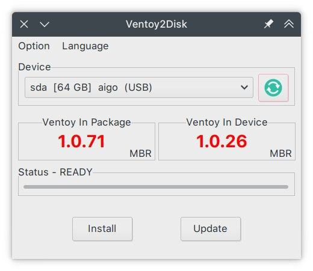
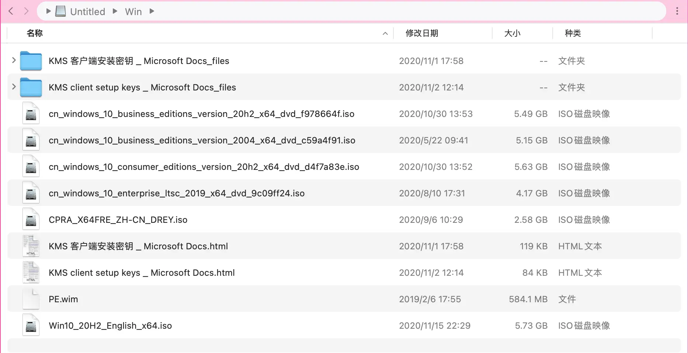
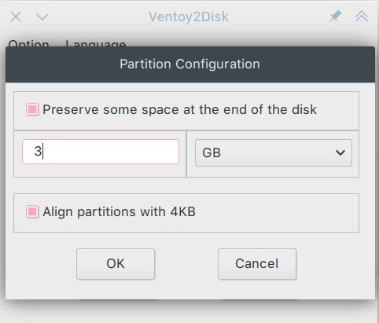
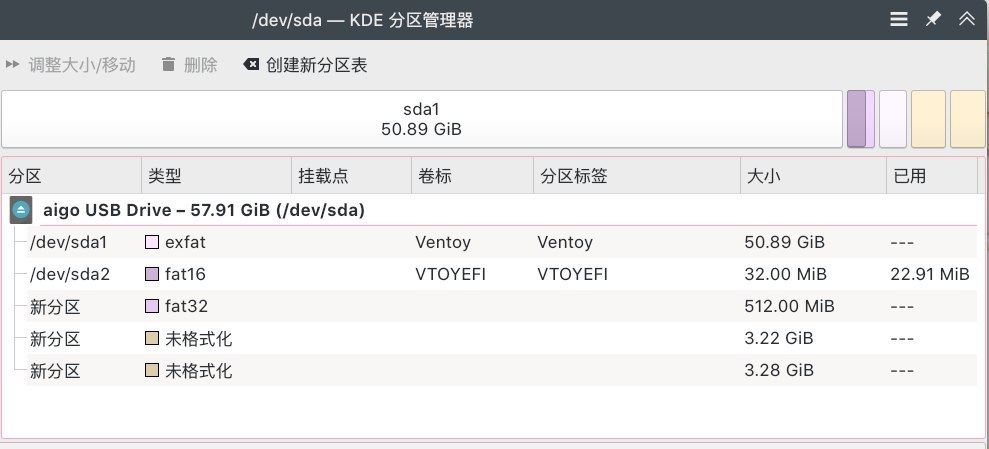
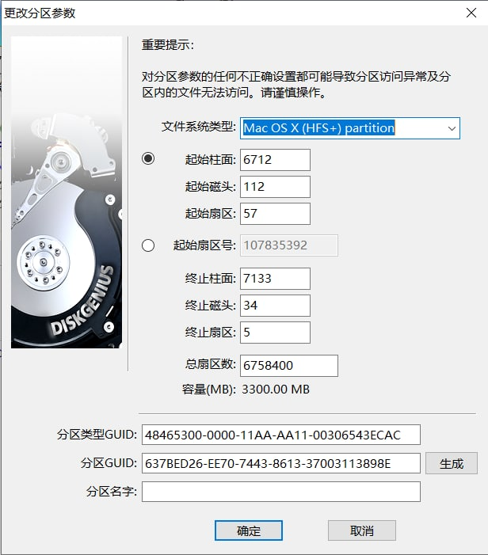
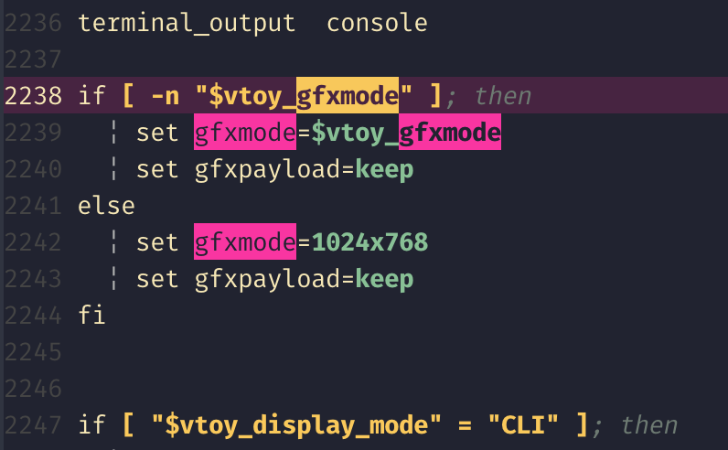
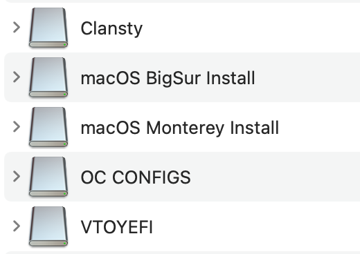
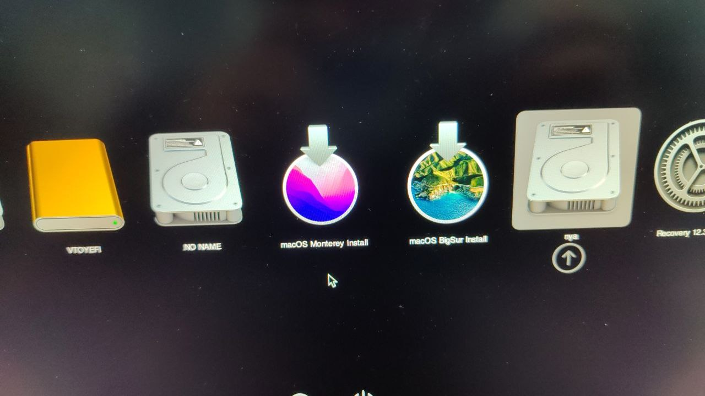

本文由**零落 Reiraku_Nya** 友情提供的 ThinkPad X1C 支持

## 起因

最近做 macOS 启动盘到时候，我想到，苹果有 12 个 G 到完整安装镜像，也有几百兆的恢复镜像。恢复镜像的功能和完整镜像一样，但是要用来安装系统的话需要联网。

要是用恢复镜像来做启动盘的话，大概应该会很轻便吧。而且我希望我可以在一个 U 盘上 [Ventoy](https://www.ventoy.net/cn/index.html) 和 [OpenCore](https://github.com/acidanthera/OpenCorePkg) 共存，只要一个 U 盘就可以启动各种系统

说起来我在 20 年发现 Ventoy 这样高级的东西的时候，就做了一个 Ventoy USB，里面放了很多镜像，塞满了 64GB 的 U 盘。现在 Ventoy 已经更新到 1.0.71 了，然而我手上的还是 1.0.26（（（



并且，U 盘里的 Windows 镜像之类也很老了，LTSC 也更新 2021 了。干脆就备份一下有用的镜像和文件重新做 U 盘了



## 思路

大概想了三种方法，分别是用 Ventoy 启动 OC，用 OC 启动 Ventoy 和用 GRUB 启动 Ventoy 和 OC

我最想实现的肯定是第一种方法，毕竟 Ventoy 的兼容性好，并且支持多种架构。虽然用 GRUB 来引导的话这两个功能不会缺少，但是也太麻烦了，而且 Ventoy 本来就是基于 GRUB 的，要是魔改不太严重的话应该不至于要这样

要是用 Ventoy 或者 GRUB 启动 OC 的话，只需要 chainload OC 的 EFI 文件就可以了

## 方法

### 先安装 Ventoy

首先是安装 Ventoy（我首先是做了裸的 GRUB 启动 USB 做测试的啦，不过我测试好了就不需要了）

下载安装文件之后点开你架构的 VentoyGUI ，稍微进行一些设置

首先不要开启 SecureBoot 的支持，这个没什么用，启用之后会在 Ventoy 启动之前启动一个被签名的证书检测和注册工具（Mok Manager Shim），然后再由它启动 Ventoy 的 GRUB。它会导致 GRUB 读取不到正确的分辨率

然后由于 OpenCore 并不能读取 exFAT 格式的分区（它也不能继承 GRUB 提供的驱动），还需要分区来写入 macOS 恢复镜像，所以我们需要在分区尾部预留一些空间将来创建新的分区。Ventoy 的设置里面提供了这个功能。如果你到时候准备放一个 macOS 版本的话，就留 4GiB。要是准备放两个的话，就留 7GiB。放两个 macOS 的话还需要把 Ventoy 的磁盘模式改为 GPT，不然分区数量不够。

当然要是你的 U 盘足够大，想放完整版安装镜像的话也可以，预留足够的空间就好



### 给剩余空间分区

现在需要给 Ventoy 预留的空间分区。首先我们需要一个 FAT32 格式的小分区保存 OpenCore 的配置（大概也许俗称 EFI？），512MiB 够放很多份不同的配置了

然后对于每一个 macOS 版本，分 3GiB 多一点点，可以不用格式化。

我准备放两个 macOS 版本的话，大概像这样：



分区创建好之后，要改一下它的标记，设置成 HFS+ 的标记，这样 macOS 和 OpenCore 可以正确识别它们

在 Linux 中可以使用 fdisk

```text
❯ sudo fdisk /dev/sda

欢迎使用 fdisk (util-linux 2.37.4)。
更改将停留在内存中，直到您决定将更改写入磁盘。
使用写入命令前请三思。

命令(输入 m 获取帮助)：t
分区号 (1-5, 默认  5): 4
分区类型或别名（输入 L 列出所有类型）：56

已将分区“Linux filesystem”的类型更改为“Apple HFS/HFS+”。

命令(输入 m 获取帮助)：w
分区表已调整。
将调用 ioctl() 来重新读分区表。
正在同步磁盘。
```

在 Windows 中可以用 DiskGenius「更改分区参数（F11）」



### 准备 OpenCore

首先找出你机型的 OpenCore 配置，也就是那个俗称 EFI 的东西，最好是你现在正在用的调试好了的。把里面那个「OC」文件夹复制到刚刚创建的那个 512MiB FAT32 分区中。

然后你可以给「OC」文件夹改个名字，比如说改成你的机型之类。如果你要放多个 OpenCore 配置的话，改名是必要的

OpenCore.plist 里面，最好设置 `ScanPolicy=0`，这样它可以尽量扫描所有可以启动的东西。然后要把启动超时调大，默认启动参数可以加个 `-v`，也就是详细输出（在 OC 界面按 Command/Win + V 也是一样的）

### 编写引导文件

Ventoy 提供了一个[自定义菜单](https://www.ventoy.net/cn/plugin_grubmenu.html)功能，可以自己编写 GRUB 配置文件作为额外菜单。我们在那里面加上 OC 的启动项

需要在 Ventoy 生成的 exFAT 格式分区里面创建 `ventoy/ventoy_grub.cfg` 配置文件

```shell
menuentry 'OpenCore' {
	search --set=root --file /ThinkPad-X1C/OpenCore.efi
	chainloader /ThinkPad-X1C/OpenCore.efi
}
```

我这里的 `ThinkPad-X1C` 是给 OC 文件夹改的名字，你们应该改成自己的。search 行表示自动查找包含这个文件的分区。

要是有多份 OpenCore 配置的话，就在同一个文件里把这段内容复制多份，并修改标题和文件夹名称

### 可以试试启动了

这时候 Ventoy 已经算是可以引导 OpenCore 了，但是不完全可以。因为有两个问题，第一是要按下 F6 才能显示包含 OC 的菜单，第二是在很多设备上 Ventoy 会自动把分辨率设置成 1024x768，导致 OpenCore 的界面因为分辨率太低显示不了

现在从 USB 启动，如果你的分辨率不是显示器分辨率的话，先按下 F5，调整分辨率之后返回主菜单。按下 F6 就可以选择 OpenCore 启动了

### 解决分辨率问题

我们稍微改一下 Ventoy 自带的 `grub.cfg`，让它不要自己设置分辨率

首先挂载 U 盘的第二个分区，也就是那个 32MiB 的 `VTOYEFI`

```bash
sudo mount /dev/sda2 /mnt
```

然后编辑里面的 `grub.conf`

```bash
sudo vim /mnt/grub/grub.efi
```

找到 `gfxmode` 出现的位置，大概是在 2238 行左右，然后删掉那一段

```shell
/gfxmode
d6j
:wq
```



现在分辨率的问题应该就解决了

### 在 Ventoy 主页创建启动项

Ventoy 可以直接 chainload 引导在那个 exFAT 分区里的 EFI 文件。我们可以创建一个内置配置文件和依赖 mods 的 GRUB EFI 可执行文件来引导另一个分区的 OpenCore

首先在随便什么位置创建一个临时的 `grub.cfg`

```bash
vim grub.cfg
```

```shell
set default=0
set timeout=0

menuentry 'OpenCore' {
	search --set=root --file /ThinkPad-X1C/OpenCore.efi
	chainloader /ThinkPad-X1C/OpenCore.efi
}
```

下半部分和前面很相似，上面增加了默认和超时设置，这样大概能感觉不到这第二个 GRUB 的存在，选择之后就能进入 OpenCore

之后通过这样的命令生成 efi 文件。这个 efi 文件的结构中嵌入了一个 tar，包含 GRUB 运行所需要的所有依赖和配置，只需要这一个文件就可以运行 GRUB

```bash
grub-mkstandalone -d /usr/lib/grub/x86_64-efi/ -O x86_64-efi --modules="part_gpt part_msdos chain fat" --locales="en@quot" -o "OpenCore for ThinkPad X1C.efi" --themes "" "boot/grub/grub.cfg=grub.cfg"
```

如果你的 U 盘包含多份 OC 配置的话，对于每一个配置都要做一份 EFI 文件，而不是像 `ventoy_grub.cfg` 一样在一个文件里写多个配置。这样在 Ventoy 菜单里会显示成多个启动项

### 写入 macOS 的恢复镜像

最后，我们向那最后的 2GiB 分区写入 macOS 的镜像

首先我们需要下载这样的镜像。我们使用[这个脚本](https://github.com/kholia/OSX-KVM/blob/master/fetch-macOS-v2.py)，它不需要什么 Python 依赖库，可以直接运行

```bash
wget https://github.com/kholia/OSX-KVM/raw/master/fetch-macOS-v2.py
python3 fetch-macOS-v2.py
```

```shell
1. High Sierra (10.13)
2. Mojave (10.14)
3. Catalina (10.15)
4. Big Sur (11.6) - RECOMMENDED
5. Monterey (latest)

Choose a product to download (1-5):
```

下载完成后就可以得到 `BaseSystem.dmg`。挂载它，然后查看新出现的设备号，以及 U 盘分区的设备号

```bash
hdiutil attach BaseSystem.dmg
diskutil list
```

```text
/dev/disk2 (disk image):
   #:                       TYPE NAME                    SIZE       IDENTIFIER
   0:      GUID_partition_scheme                        +3.2 GB     disk2
   1:                  Apple_HFS macOS Base System       2.9 GB     disk2s1

/dev/disk3 (external, physical):
   #:                       TYPE NAME                    SIZE       IDENTIFIER
   0:      GUID_partition_scheme                        *62.2 GB    disk3
   1:       Microsoft Basic Data Clansty                 54.6 GB    disk3s1
   2:       Microsoft Basic Data VTOYEFI                 33.6 MB    disk3s2
   3:       Microsoft Basic Data OC CONFIGS              536.9 MB   disk3s3
   4:                  Apple_HFS                         3.5 GB     disk3s4
   5:                  Apple_HFS                         3.5 GB     disk3s5
```

像这里，我们挂载的位置是 disk2s1，想要写入的位置是 disk3s4

然后首先需要取消当前磁盘镜像的分区挂载，因为不然的话 dd 会显示资源正忙。取消挂载分区并不会卸载磁盘镜像。然后再 dd 到目标分区里去

```bash
umount /dev/disk2s1
sudo dd if=/dev/disk2s1 of=/dev/disk3s4 status=progress bs=4096
```

dd 执行完成之后，在桌面上先推出 U 盘的其他分区，然后重新拔插 U 盘，新的分区就可以被识别了，然后可以给分区改个名字。



现在，这个 U 盘就可以正常做各种系统的启动盘了

### 给分区改个图标吧

在桌面上右键写好的安装盘的分区，点击「查看简介」。同时打开分区，右键那个安装器，「显示包内容」，然后可以在 `Contents/Resources` 中找到系统对应的图标文件。把图标文件拖放到简介中左上角的小磁盘图标上就可以了。当然也可以用自己喜欢的别的图片。这样更换的图标也会在 OpenCore 中显示，看起来更舒服

最后做好的 USB 启动盘，进入 OpenCore 之后大概是这个样子


